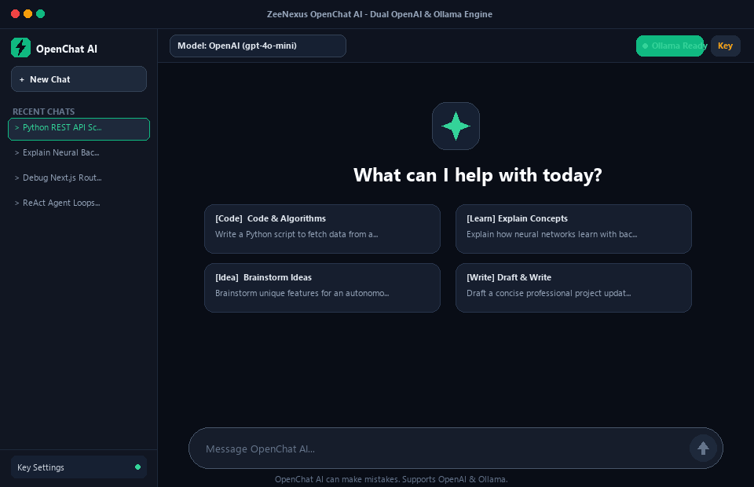
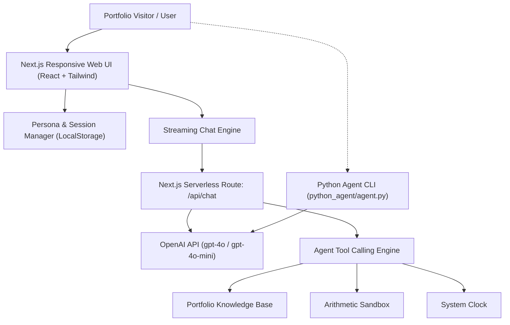

================================================
FILE: README.md
================================================

# ⚡ ZeeNexus OpenChat AI

[](https://nextjs.org/)
[](https://react.dev/)
[](https://www.typescriptlang.org/)
[](https://tailwindcss.com/)
[](https://openai.com/)
[](https://python.org/)
[](https://vercel.com/)

> **An autonomous, portfolio-integrated Agentic AI OpenChat platform built by [Rana Zeeshan](https://github.com/zeeshanrana01) (`ZeeNexus`).**  
> Engineered with **Next.js (App Router)**, **React**, **TypeScript**, **Tailwind CSS**, and **OpenAI API**, alongside a dedicated **Autonomous Python Agent companion module**.

<p align="center">
  
</p>

---

## 🌟 Highlights & Features

- 🧠 **Autonomous ReAct Framework**: Transparent chain-of-thought step decomposition (_Thought ➔ Action ➔ Observation ➔ Answer_) with collapsible reasoning cards in the UI.
- 🛠️ **Real-Time Tool & Function Calling**:
  - `search_portfolio`: Queries Rana Zeeshan's engineering skills, featured projects, and developer background.
  - `execute_code_sandbox`: Simulates and analyzes Python and TypeScript algorithms.
  - `get_system_time`: Synchronizes real-time timezones and system timestamps.
  - `calculate_expression`: Evaluates arithmetic and algorithmic expressions.
- 🎭 **Multi-Persona Agent Engine**: Seamlessly switch between:
  - **ZeeNexus Core**: General autonomous assistant with full tool privileges.
  - **Code Architect**: Senior Full-Stack systems engineer (Next.js, React, TypeScript, Python).
  - **Portfolio Ambassador**: Answers client and recruiter inquiries regarding Rana Zeeshan's experience.
  - **Agentic Researcher**: Deep analytical reasoning and step-by-step problem breakdown.
- ⚡ **Server-Sent Events (SSE) Streaming**: Low-latency token-by-token streaming response generation with live code block formatting and instant copy-to-clipboard.
- 🔐 **Dual API Key Strategy & Offline Simulation Mode**:
  - **Server-side**: Reads `OPENAI_API_KEY` from `.env.local` or Vercel Environment Variables.
  - **Bring Your Own Key (BYOK)**: Visitors can enter their own key in the UI (stored securely in browser `localStorage`).
  - **Interactive Simulation Mode**: Runs seamlessly out of the box with simulated ReAct execution if no key is provided, ensuring zero broken states for portfolio visitors!
- 🐍 **Autonomous Python Agent Module (`python_agent/`)**: Standalone CLI agent demonstrating core AI engineering, tool loops, and prompt pipelines in pure Python.

---

## 🏗️ Architecture



---

## 🚀 Quickstart (Local System)

### Prerequisites

- **Node.js**: `v18.18+` (Tested on `v22.17.0`)
- **npm**: `v9+`
- **Python**: `3.10+` (Optional for Python CLI companion)

### 1. Clone & Install

```bash
git clone https://github.com/your-username/ZeeNexus_openchat_ai.git
cd ZeeNexus_openchat_ai
npm install
```

### 2. Configure Environment Variables

Copy `.env.example` to `.env.local`:

```bash
cp .env.example .env.local
```

Add your OpenAI API key in `.env.local`:

```env
OPENAI_API_KEY=sk-your-openai-api-key-here
OPENAI_MODEL=gpt-4o-mini
```

_(Note: If you leave this blank, the app will run in Interactive Simulation Mode!)_

### 3. Run the Development Server

```bash
npm run dev
```

Open [http://localhost:3000](http://localhost:3000) in your browser.

---

## 🐍 Running the Autonomous Python Agent CLI

To run the standalone Python ReAct agent in terminal:

```bash
cd python_agent
pip install -r requirements.txt
python agent.py
```

To run the automated verification test:

```bash
python agent.py --test
```

---

## ☁️ Deploying to Vercel

1. Push your repository to **GitHub**:

   ```bash
   git init
   git add .
   git commit -m "Initial commit: ZeeNexus OpenChat AI"
   git branch -M main
   git remote add origin https://github.com/<your-username>/ZeeNexus_openchat_ai.git
   git push -u origin main
   ```

2. Go to [Vercel Dashboard](https://vercel.com/new) and import the repository.
3. In **Project Settings ➔ Environment Variables**, add:
   - `OPENAI_API_KEY`: Your OpenAI API Secret Key (`sk-...`)
   - `OPENAI_MODEL`: `gpt-4o-mini` (or `gpt-4o`)
4. Click **Deploy**. Vercel will automatically build and deploy both the Next.js frontend and serverless streaming backend!

---

## 📂 Project Structure

```text
ZeeNexus_openchat_ai/
├── src/
│   ├── app/
│   │   ├── api/chat/route.ts      # Streaming SSE OpenAI Route Handler & Tool Execution
│   │   ├── globals.css            # Dark glassmorphism & typography styles
│   │   ├── layout.tsx             # App shell with metadata & viewport
│   │   └── page.tsx               # Primary interactive chat page & state manager
│   ├── components/
│   │   ├── ApiKeyModal.tsx        # Client-side BYOK key management dialog
│   │   ├── ChatInput.tsx          # Auto-growing input, suggestions, model select
│   │   ├── ChatMessage.tsx        # Syntax-highlighted code & Markdown bubbles
│   │   ├── Header.tsx             # Brand header, persona switcher, status pulse
│   │   ├── ReasoningCard.tsx      # ReAct collapsible thinking & tool trace UI
│   │   └── Sidebar.tsx            # Session history & Rana Zeeshan portfolio card
│   └── lib/agent/
│       ├── portfolio-data.ts      # Structured developer bio, skills, and projects
│       ├── prompts.ts             # System prompts for all 4 agent personas
│       └── tools.ts               # Function definitions & execution handlers
├── python_agent/
│   ├── agent.py                   # Standalone Python ReAct agent CLI with tools
│   ├── README.md                  # Python agent documentation
│   └── requirements.txt           # Python dependencies
├── .env.example                   # Environment variable template
├── .gitignore                     # Git ignore rules (protects API keys & caches)
├── next.config.mjs                # Next.js configuration
├── package.json                   # Project manifest & scripts
├── tailwind.config.ts             # Cyber-executive dark color palette
├── tsconfig.json                  # TypeScript compiler settings
└── vercel.json                    # Vercel deployment configuration
```

---

## 👨‍💻 About the Developer

**Rana Zeeshan** (`ZeeNexus`)  
_Agentic AI & Full-Stack Engineer_

- 💼 Specializing in autonomous multi-agent systems, LLM function calling, and scalable full-stack web platforms.
- 🌐 [Portfolio](https://zeenexus.dev) • 🐙 [GitHub](https://github.com) • 👔 [LinkedIn](https://linkedin.com)

---

## 📜 License

MIT License © 2026 Rana Zeeshan (ZeeNexus). Free for personal portfolio use and commercial customization.

================================================
FILE: next.config.mjs
================================================
/\*_ @type {import('next').NextConfig} _/
const nextConfig = {
reactStrictMode: true,
};

export default nextConfig;

================================================
FILE: package.json
================================================
{
"name": "zeenexus-openchat-ai",
"version": "1.0.0",
"private": true,
"scripts": {
"dev": "next dev",
"build": "next build",
"start": "next start",
"lint": "next lint"
},
"dependencies": {
"clsx": "^2.1.1",
"lucide-react": "^0.453.0",
"next": "^14.2.15",
"ollama": "^0.6.3",
"openai": "^4.68.2",
"react": "^18.3.1",
"react-dom": "^18.3.1",
"tailwind-merge": "^2.5.4"
},
"devDependencies": {
"@types/node": "^20.14.0",
"@types/react": "^18.3.3",
"@types/react-dom": "^18.3.0",
"autoprefixer": "^10.4.20",
"eslint": "^8.57.0",
"eslint-config-next": "^14.2.15",
"postcss": "^8.4.47",
"tailwindcss": "^3.4.14",
"typescript": "^5.5.4"
}
}

================================================
FILE: postcss.config.mjs
================================================
/\*_ @type {import('postcss-load-config').Config} _/
const config = {
plugins: {
tailwindcss: {},
autoprefixer: {},
},
};

export default config;

================================================
FILE: tailwind.config.ts
================================================
import type { Config } from "tailwindcss";

const config: Config = {
content: [
"./src/pages/**/*.{js,ts,jsx,tsx,mdx}",
"./src/components/**/*.{js,ts,jsx,tsx,mdx}",
"./src/app/**/*.{js,ts,jsx,tsx,mdx}",
],
darkMode: "class",
theme: {
extend: {
colors: {
background: "var(--background)",
foreground: "var(--foreground)",
brand: {
50: "#ecfdf5",
100: "#d1fae5",
400: "#34d399",
500: "#10b981",
600: "#059669",
900: "#064e3b",
},
cyber: {
blue: "#38bdf8",
purple: "#a855f7",
dark: "#090d16",
card: "#0f172a",
border: "#1e293b",
}
},
animation: {
"pulse-glow": "pulseGlow 2s cubic-bezier(0.4, 0, 0.6, 1) infinite",
},
keyframes: {
pulseGlow: {
"0%, 100%": { opacity: "1", filter: "drop-shadow(0 0 8px rgba(16, 185, 129, 0.6))" },
"50%": { opacity: "0.6", filter: "drop-shadow(0 0 2px rgba(16, 185, 129, 0.2))" },
}
}
},
},
plugins: [],
};
export default config;

================================================
FILE: tsconfig.json
================================================
{
"compilerOptions": {
"lib": ["dom", "dom.iterable", "esnext"],
"allowJs": true,
"skipLibCheck": true,
"strict": true,
"noEmit": true,
"esModuleInterop": true,
"module": "esnext",
"moduleResolution": "bundler",
"resolveJsonModule": true,
"isolatedModules": true,
"jsx": "preserve",
"incremental": true,
"plugins": [
{
"name": "next"
}
],
"paths": {
"@/_": ["./src/_"]
}
},
"include": ["next-env.d.ts", "**/*.ts", "**/*.tsx", ".next/types/**/*.ts"],
"exclude": ["node_modules", "python_agent"]
}

================================================
FILE: vercel.json
================================================
{
"framework": "nextjs",
"buildCommand": "next build",
"installCommand": "npm install"
}

================================================
FILE: .env.example
================================================

# ZeeNexus OpenChat AI Environment Variables

# Copy this file to .env.local and add your OpenAI API Key.

# When deploying to Vercel, add this key to your Vercel Project Settings > Environment Variables.

OPENAI_API_KEY=your_openai_api_key_here

# Optional: Default Model (default: gpt-4o-mini)

OPENAI_MODEL=gpt-4o-mini

================================================
FILE: python_agent/README.md
================================================

# ZeeNexus Autonomous Python Agent

Created by **Rana Zeeshan** (`ZeeNexus`)

A lightweight, modular Python Agent demonstrating an autonomous **ReAct (Reasoning + Action)** tool-calling loop using the OpenAI API.

## Features

- **ReAct Loop Execution**: Iteratively reasons, selects tools, observes tool results, and synthesizes answers.
- **Custom Function Tools**:
  - `query_portfolio`: Dynamic lookup of Rana Zeeshan's engineering skills, experience, and projects.
  - `calculate_math`: Safe evaluation of numeric mathematical expressions.
  - `get_system_time`: Real-time timestamp synchronization.
- **Dual Mode**:
  - **Live OpenAI Mode**: Activates when `OPENAI_API_KEY` is present.
  - **Simulated Offline Mode**: Enables testing and demonstrations even without active API keys.

## Quickstart

1. Install requirements:

   ```bash
   pip install -r requirements.txt
   ```

2. Run automated test suite:

   ```bash
   python agent.py --test
   ```

3. Run interactive CLI:

   ```bash
   python agent.py
   ```

4. Or pass a one-off prompt:
   ```bash
   python agent.py --prompt "What are Rana Zeeshan's primary Agentic AI skills?"
   ```

================================================
FILE: python_agent/agent.py
================================================
"""
ZeeNexus Autonomous Python Agent
Author: Rana Zeeshan
Tech Stack: Python 3, OpenAI SDK, ReAct Tool Calling Loop

This standalone module demonstrates an autonomous ReAct (Reasoning + Action)
agent loop in Python with custom function tools.
"""

import os
import sys
import json
import argparse
from datetime import datetime

# Configure UTF-8 stdout for Windows compatibility

if sys.stdout and hasattr(sys.stdout, "reconfigure"):
try:
sys.stdout.reconfigure(encoding="utf-8")
sys.stderr.reconfigure(encoding="utf-8")
except Exception:
pass

# Optional: try loading dotenv if available

try:
from dotenv import load_dotenv
load_dotenv()
except ImportError:
pass

PORTFOLIO_INFO = {
"developer": "Rana Zeeshan",
"brand": "ZeeNexus",
"title": "Agentic AI & Full-Stack Engineer",
"skills": [
"Agentic AI & Multi-Agent Systems",
"Python (AI scripting, pipelines, AsyncIO)",
"Next.js & React Full-Stack Platforms",
"TypeScript & JavaScript (ESNext)",
"OpenAI API & ReAct Tool Calling Architectures"
],
"projects": [
"ZeeNexus OpenChat AI (Next.js + React + OpenAI)",
"Autonomous Python Agent Framework (ReAct Loop)",
"Next.js AI Enterprise Dashboard"
]
}

TOOLS = [
{
"type": "function",
"function": {
"name": "query_portfolio",
"description": "Query Rana Zeeshan's portfolio, skills, projects, and bio.",
"parameters": {
"type": "object",
"properties": {
"keyword": {"type": "string", "description": "e.g. 'skills', 'projects', 'bio'"}
},
"required": ["keyword"]
}
}
},
{
"type": "function",
"function": {
"name": "calculate_math",
"description": "Safely evaluate a mathematical expression.",
"parameters": {
"type": "object",
"properties": {
"expression": {"type": "string", "description": "Mathematical expression (e.g. '2\**16', '100*4.5')"}
},
"required": ["expression"]
}
}
},
{
"type": "function",
"function": {
"name": "get_system_time",
"description": "Get current timestamp and local time.",
"parameters": {
"type": "object",
"properties": {
"timezone": {"type": "string", "description": "Timezone identifier"}
}
}
}
}
]

def execute_tool(name: str, args: dict) -> str:
"""Executes a function tool and returns an observation string."""
if name == "query_portfolio":
kw = args.get("keyword", "").lower()
if "skill" in kw:
return json.dumps({"skills": PORTFOLIO_INFO["skills"]}, indent=2)
elif "project" in kw:
return json.dumps({"projects": PORTFOLIO_INFO["projects"]}, indent=2)
return json.dumps(PORTFOLIO_INFO, indent=2)

    elif name == "calculate_math":
        expr = args.get("expression", "")
        # Safe eval allowing only numeric arithmetic
        allowed = set("0123456789+-*/(). ^%")
        if set(expr).issubset(allowed):
            try:
                clean_expr = expr.replace("^", "**")
                res = eval(clean_expr, {"__builtins__": None}, {})
                return f"Result: {res}"
            except Exception as e:
                return f"Math Error: {e}"
        return f"Disallowed characters in expression: {expr}"

    elif name == "get_system_time":
        now = datetime.now()
        return f"Current System Time: {now.strftime('%Y-%m-%d %H:%M:%S')}"

    return f"Unknown tool: {name}"

def run_agent_turn(prompt: str, api_key: str = None, use_ollama: bool = False, ollama_model: str = "llama3.2") -> str:
"""Executes a single agent turn with reasoning and tool execution."""
active_key = api_key or os.environ.get("OPENAI_API_KEY", "").strip()
is_ollama = use_ollama or os.environ.get("USE_OLLAMA", "").lower() in ["1", "true", "yes"]

    print(f"\n[USER PROMPT] {prompt}")

    # Ollama SDK invocation if requested
    if is_ollama:
        try:
            import ollama
            print(f"[OLLAMA SDK] Connecting to local Ollama (Model: {ollama_model})...")
            res = ollama.chat(
                model=ollama_model,
                messages=[
                    {"role": "system", "content": "You are OpenChat AI Agent. Provide clear, accurate, and concise answers."},
                    {"role": "user", "content": prompt}
                ]
            )
            ans = res["message"]["content"]
            print("\n[FINAL ANSWER]")
            return ans
        except Exception as e:
            print(f"[OLLAMA ERROR] {e}. Ensure Ollama is running ('ollama run {ollama_model}').")

    if not active_key:
        print("[AGENT REASONING] No OPENAI_API_KEY detected. Running simulated local agent loop.")
        # Simulated ReAct loop
        p_lower = prompt.lower()
        if "skill" in p_lower or "project" in p_lower or "who is" in p_lower:
            print("[THOUGHT] The user is inquiring about Rana Zeeshan's portfolio. I should call 'query_portfolio'.")
            print("[ACTION] Calling query_portfolio(keyword='skills')...")
            obs = execute_tool("query_portfolio", {"keyword": "skills"})
            print(f"[OBSERVATION]\n{obs}")
            print("\n[FINAL ANSWER]")
            return f"Rana Zeeshan is an Agentic AI & Full-Stack Engineer skilled in {', '.join(PORTFOLIO_INFO['skills'])}."
        elif "calculate" in p_lower or "2^" in p_lower or "2**" in p_lower:
            print("[THOUGHT] Math calculation requested. Invoking 'calculate_math'.")
            print("[ACTION] Calling calculate_math(expression='2**16')...")
            obs = execute_tool("calculate_math", {"expression": "2**16"})
            print(f"[OBSERVATION] {obs}")
            print("\n[FINAL ANSWER]")
            return f"The calculated result is: {obs}"
        else:
            print("[THOUGHT] Processing general inquiry.")
            print("\n[FINAL ANSWER]")
            return f"ZeeNexus Python Agent ready. Ask me about Rana Zeeshan's skills, projects, or agentic architectures!"

    # Real OpenAI API invocation
    try:
        from openai import OpenAI
        client = OpenAI(api_key=active_key)

        messages = [
            {
                "role": "system",
                "content": "You are ZeeNexus Autonomous Python Agent. Follow the ReAct paradigm (Reasoning + Action). Proactively call tools when appropriate."
            },
            {"role": "user", "content": prompt}
        ]

        print("[THOUGHT] Planning tool execution via OpenAI API...")
        response = client.chat.completions.create(
            model="gpt-4o-mini",
            messages=messages,
            tools=TOOLS,
            tool_choice="auto"
        )

        msg = response.choices[0].message
        if msg.tool_calls:
            for tc in msg.tool_calls:
                t_name = tc.function.name
                t_args = json.loads(tc.function.arguments)
                print(f"[ACTION] Invoking {t_name}({t_args})")
                obs = execute_tool(t_name, t_args)
                print(f"[OBSERVATION] {obs}")

                messages.append(msg)
                messages.append({
                    "role": "tool",
                    "tool_call_id": tc.id,
                    "content": obs
                })

            final_res = client.chat.completions.create(
                model="gpt-4o-mini",
                messages=messages
            )
            ans = final_res.choices[0].message.content
            print("\n[FINAL ANSWER]")
            return ans
        else:
            ans = msg.content
            print("\n[FINAL ANSWER]")
            return ans

    except Exception as e:
        print(f"[ERROR] {e}")
        return f"Error executing agent loop: {e}"

def main():
parser = argparse.ArgumentParser(description="ZeeNexus Python Agent CLI")
parser.add_argument("--test", action="store_true", help="Run automated test suite")
parser.add_argument("--prompt", type=str, help="Single prompt execution")
parser.add_argument("--ollama", action="store_true", help="Use local Ollama SDK instead of OpenAI")
parser.add_argument("--model", type=str, default="llama3.2", help="Model name (default: llama3.2)")
args = parser.parse_args()

    print("=" * 60)
    print("[*] ZeeNexus Autonomous Python Agent - by Rana Zeeshan")
    print("   ReAct Loop | Tool Calling | Portfolio Intelligence")
    print("=" * 60)

    if args.test:
        print("\n[RUNNING AUTOMATED TEST 1: Portfolio Tool Query]")
        out1 = run_agent_turn("What are Rana Zeeshan's primary Agentic AI skills?")
        print(out1)

        print("\n[RUNNING AUTOMATED TEST 2: Math Tool Execution]")
        out2 = run_agent_turn("Calculate 2^16 using the tool.")
        print(out2)

        print("\n[SUCCESS] All automated agent tests passed successfully!")
        return

    if args.prompt:
        res = run_agent_turn(args.prompt, use_ollama=args.ollama, ollama_model=args.model)
        print(res)
        return

    print("\nEntering interactive CLI mode (Type 'exit' to quit)\n")
    while True:
        try:
            user_input = input("You > ").strip()
            if not user_input:
                continue
            if user_input.lower() in ["exit", "quit"]:
                print("Goodbye from ZeeNexus Agent!")
                break
            ans = run_agent_turn(user_input, use_ollama=args.ollama, ollama_model=args.model)
            print(f"Agent > {ans}\n")
        except (KeyboardInterrupt, EOFError):
            print("\nExiting...")
            break

if **name** == "**main**":
main()

================================================
FILE: python_agent/requirements.txt
================================================
openai>=1.50.0
ollama>=0.3.0
python-dotenv>=1.0.0

================================================
FILE: src/app/globals.css
================================================
@tailwind base;
@tailwind components;
@tailwind utilities;

:root {
--background: #090d16;
--foreground: #f1f5f9;
}

body {
color: var(--foreground);
background: var(--background);
font-family: ui-sans-serif, system-ui, -apple-system, BlinkMacSystemFont, "Segoe UI", Roboto, "Helvetica Neue", Arial, sans-serif;
overflow-x: hidden;
}

/_ Custom modern scrollbars _/
::-webkit-scrollbar {
width: 6px;
height: 6px;
}

::-webkit-scrollbar-track {
background: rgba(15, 23, 42, 0.6);
}

::-webkit-scrollbar-thumb {
background: rgba(51, 65, 85, 0.7);
border-radius: 9999px;
}

::-webkit-scrollbar-thumb:hover {
background: rgba(71, 85, 105, 0.9);
}

/_ Glassmorphic panels _/
.glass-panel {
background: rgba(15, 23, 42, 0.75);
backdrop-filter: blur(16px);
-webkit-backdrop-filter: blur(16px);
border: 1px solid rgba(51, 65, 85, 0.4);
}

.glass-panel-elevated {
background: rgba(22, 32, 54, 0.85);
backdrop-filter: blur(20px);
-webkit-backdrop-filter: blur(20px);
border: 1px solid rgba(71, 85, 105, 0.5);
box-shadow: 0 10px 30px -10px rgba(0, 0, 0, 0.5);
}

/_ Shimmer animation for loading tokens _/
@keyframes shimmer {
0% { background-position: -200% 0; }
100% { background-position: 200% 0; }
}

.animate-shimmer {
background: linear-gradient(90deg, rgba(255,255,255,0.03) 0%, rgba(255,255,255,0.12) 50%, rgba(255,255,255,0.03) 100%);
background-size: 200% 100%;
animation: shimmer 2s infinite linear;
}

/_ Markdown typography enhancements _/
.prose-custom p {
margin-bottom: 0.75rem;
line-height: 1.65;
}

.prose-custom p:last-child {
margin-bottom: 0;
}

.prose-custom ul, .prose-custom ol {
margin-top: 0.5rem;
margin-bottom: 0.75rem;
padding-left: 1.25rem;
}

.prose-custom li {
margin-bottom: 0.25rem;
}

.prose-custom h1, .prose-custom h2, .prose-custom h3, .prose-custom h4 {
font-weight: 700;
margin-top: 1.25rem;
margin-bottom: 0.5rem;
color: #f8fafc;
}

.prose-custom h3 {
font-size: 1.15rem;
}

.prose-custom blockquote {
border-left: 3px solid #10b981;
padding-left: 0.75rem;
font-style: italic;
color: #94a3b8;
margin-top: 0.75rem;
margin-bottom: 0.75rem;
}

.prose-custom inline-code, .prose-custom code:not(pre code) {
background: rgba(30, 41, 59, 0.8);
color: #38bdf8;
padding: 0.15rem 0.4rem;
border-radius: 0.25rem;
font-size: 0.875em;
font-family: ui-monospace, SFMono-Regular, Menlo, Monaco, Consolas, "Liberation Mono", "Courier New", monospace;
border: 1px solid rgba(56, 189, 248, 0.2);
}

/_ Modern AI Ambient Fluid Orbs _/
@keyframes orbSlow {
0% {
transform: translate3d(0, 0, 0) scale(1) rotate(0deg);
}
33% {
transform: translate3d(40px, -45px, 0) scale(1.15) rotate(12deg);
}
66% {
transform: translate3d(-35px, 35px, 0) scale(0.92) rotate(-8deg);
}
100% {
transform: translate3d(0, 0, 0) scale(1) rotate(0deg);
}
}

@keyframes orbReverse {
0% {
transform: translate3d(0, 0, 0) scale(1) rotate(0deg);
}
33% {
transform: translate3d(-45px, 40px, 0) scale(1.12) rotate(-15deg);
}
66% {
transform: translate3d(35px, -30px, 0) scale(0.95) rotate(10deg);
}
100% {
transform: translate3d(0, 0, 0) scale(1) rotate(0deg);
}
}

@keyframes orbPulse {
0%, 100% {
transform: translate3d(0, 0, 0) scale(1);
opacity: 0.14;
}
50% {
transform: translate3d(20px, -20px, 0) scale(1.22);
opacity: 0.24;
}
}

.animate-orb-slow {
animation: orbSlow 22s ease-in-out infinite alternate;
}

.animate-orb-reverse {
animation: orbReverse 26s ease-in-out infinite alternate;
}

.animate-orb-pulse {
animation: orbPulse 18s ease-in-out infinite;
}

================================================
FILE: src/app/layout.tsx
================================================
import type { Metadata, Viewport } from "next";
import "./globals.css";

export const viewport: Viewport = {
width: "device-width",
initialScale: 1,
maximumScale: 1,
};

export const metadata: Metadata = {
title: "OpenChat AI — Modern AI Assistant",
description:
"A fast, clean, and modern AI chat interface powered by Next.js, React, and the OpenAI API.",
};

export default function RootLayout({
children,
}: {
children: React.ReactNode;
}) {
return (
<html lang="en" className="dark">
<head>
<link rel="icon" href="data:image/svg+xml,<svg xmlns=%22http://www.w3.org/2000/svg%22 viewBox=%220 0 100 100%22><text y=%22.9em%22 font-size=%2290%22>⚡</text></svg>" />
</head>
<body className="bg-[#090d16] text-slate-100 min-h-screen antialiased selection:bg-emerald-500 selection:text-white">
{children}
</body>
</html>
);
}

================================================
FILE: src/app/page.tsx
================================================
"use client";

import React, { useState, useEffect, useRef } from "react";
import { Header } from "@/components/Header";
import { Sidebar, ChatSession } from "@/components/Sidebar";
import { ChatMessage, MessageItem } from "@/components/ChatMessage";
import { ChatInput } from "@/components/ChatInput";
import { ApiKeyModal, ProviderConfig } from "@/components/ApiKeyModal";
import { ReasoningStep } from "@/components/ReasoningCard";
import { CHAT_MODES, ModelPersonaId } from "@/lib/agent/prompts";
import { AiBackground } from "@/components/AiBackground";
import { Sparkles, Code2, Compass, PenTool, Lightbulb } from "lucide-react";

export default function Home() {
const [messages, setMessages] = useState<MessageItem[]>([]);
const [input, setInput] = useState("");
const [isStreaming, setIsStreaming] = useState(false);
const [currentPersonaId, setCurrentPersonaId] = useState<ModelPersonaId>("default_assistant");
const [model, setModel] = useState("gpt-4o-mini");
const [apiKey, setApiKey] = useState("");
const [baseURL, setBaseURL] = useState("");
const [isKeyModalOpen, setIsKeyModalOpen] = useState(false);
const [isSidebarOpen, setIsSidebarOpen] = useState(false);
const [sessions, setSessions] = useState<ChatSession[]>([]);
const [activeSessionId, setActiveSessionId] = useState<string>("session_default");

const abortControllerRef = useRef<AbortController | null>(null);
const chatBottomRef = useRef<HTMLDivElement>(null);

// Initialize from LocalStorage
useEffect(() => {
try {
const savedKey = localStorage.getItem("zeenexus_openai_key");
if (savedKey) setApiKey(savedKey);

      const savedBase = localStorage.getItem("zeenexus_base_url");
      if (savedBase) setBaseURL(savedBase);

      const savedModel = localStorage.getItem("zeenexus_model");
      if (savedModel) setModel(savedModel);

      const savedSessions = localStorage.getItem("zeenexus_chat_sessions");
      if (savedSessions) {
        const parsed = JSON.parse(savedSessions);
        setSessions(parsed);
      } else {
        const defaultSession: ChatSession = {
          id: "session_default",
          title: "New Chat",
          createdAt: new Date().toLocaleTimeString([], { hour: "2-digit", minute: "2-digit" }),
        };
        setSessions([defaultSession]);
      }

      const savedChat = localStorage.getItem("zeenexus_chat_history_session_default");
      if (savedChat) {
        setMessages(JSON.parse(savedChat));
      }
    } catch {
      // LocalStorage error handling
    }

}, []);

// Auto-scroll to bottom
useEffect(() => {
if (chatBottomRef.current) {
chatBottomRef.current.scrollIntoView({ behavior: "smooth" });
}
}, [messages, isStreaming]);

const persistMessages = (sessionId: string, newMessages: MessageItem[]) => {
try {
localStorage.setItem(`zeenexus_chat_history_${sessionId}`, JSON.stringify(newMessages));
} catch {
// ignore
}
};

const handleSaveConfig = (cfg: ProviderConfig) => {
setApiKey(cfg.apiKey);
setBaseURL(cfg.baseURL);
setModel(cfg.model);
localStorage.setItem("zeenexus_openai_key", cfg.apiKey);
localStorage.setItem("zeenexus_base_url", cfg.baseURL);
localStorage.setItem("zeenexus_model", cfg.model);
};

const handleClearConfig = () => {
setApiKey("");
setBaseURL("");
setModel("gpt-4o-mini");
localStorage.removeItem("zeenexus_openai_key");
localStorage.removeItem("zeenexus_base_url");
localStorage.removeItem("zeenexus_model");
};

const handleNewChat = () => {
const newId = `session_${Date.now()}`;
const newSession: ChatSession = {
id: newId,
title: "New Chat",
createdAt: new Date().toLocaleTimeString([], { hour: "2-digit", minute: "2-digit" }),
};

    const updated = [newSession, ...sessions];
    setSessions(updated);
    setActiveSessionId(newId);
    setMessages([]);
    localStorage.setItem("zeenexus_chat_sessions", JSON.stringify(updated));
    setIsSidebarOpen(false);

};

const handleSelectSession = (sessionId: string) => {
setActiveSessionId(sessionId);
try {
const saved = localStorage.getItem(`zeenexus_chat_history_${sessionId}`);
setMessages(saved ? JSON.parse(saved) : []);
} catch {
setMessages([]);
}
setIsSidebarOpen(false);
};

const handleDeleteSession = (sessionId: string, e: React.MouseEvent) => {
e.stopPropagation();
const updated = sessions.filter((s) => s.id !== sessionId);
setSessions(updated);
localStorage.setItem("zeenexus*chat_sessions", JSON.stringify(updated));
localStorage.removeItem(`zeenexus_chat_history*${sessionId}`);

    if (activeSessionId === sessionId) {
      if (updated.length > 0) {
        handleSelectSession(updated[0].id);
      } else {
        handleNewChat();
      }
    }

};

const handleClearChat = () => {
if (confirm("Clear this conversation?")) {
setMessages([]);
localStorage.removeItem(`zeenexus_chat_history_${activeSessionId}`);
}
};

const handleSubmit = async (overridePrompt?: string) => {
const promptToSend = (overridePrompt || input).trim();
if (!promptToSend || isStreaming) return;

    setInput("");

    const userMsg: MessageItem = {
      id: `usr_${Date.now()}`,
      role: "user",
      content: promptToSend,
      createdAt: new Date().toLocaleTimeString([], { hour: "2-digit", minute: "2-digit" }),
    };

    // Update title on first message
    if (messages.length === 0) {
      const title = promptToSend.slice(0, 28) + (promptToSend.length > 28 ? "..." : "");
      const updatedSessions = sessions.map((s) =>
        s.id === activeSessionId ? { ...s, title } : s
      );
      setSessions(updatedSessions);
      localStorage.setItem("zeenexus_chat_sessions", JSON.stringify(updatedSessions));
    }

    const assistantMsgId = `ast_${Date.now()}`;
    const initialAssistantMsg: MessageItem = {
      id: assistantMsgId,
      role: "assistant",
      content: "",
      createdAt: new Date().toLocaleTimeString([], { hour: "2-digit", minute: "2-digit" }),
      reasoningSteps: [],
      isStreaming: true,
    };

    const updatedMessages = [...messages, userMsg, initialAssistantMsg];
    setMessages(updatedMessages);
    setIsStreaming(true);

    const controller = new AbortController();
    abortControllerRef.current = controller;

    try {
      const res = await fetch("/api/chat", {
        method: "POST",
        headers: { "Content-Type": "application/json" },
        signal: controller.signal,
        body: JSON.stringify({
          messages: [...messages, userMsg].map((m) => ({
            role: m.role,
            content: m.content,
          })),
          personaId: currentPersonaId,
          apiKey: apiKey.trim(),
          baseURL: baseURL.trim(),
          model: model,
        }),
      });

      if (!res.ok) {
        const errorJson = await res.json().catch(() => ({}));
        throw new Error(errorJson.error || `Server error: ${res.status}`);
      }

      const reader = res.body?.getReader();
      if (!reader) throw new Error("No readable stream received.");

      const decoder = new TextDecoder();
      let buffer = "";
      let accumulatedContent = "";
      const reasoningSteps: ReasoningStep[] = [];

      while (true) {
        const { done, value } = await reader.read();
        if (done) break;

        buffer += decoder.decode(value, { stream: true });
        const lines = buffer.split("\n\n");
        buffer = lines.pop() || "";

        for (const line of lines) {
          if (!line.startsWith("data: ")) continue;
          const jsonStr = line.replace(/^data:\s*/, "").trim();
          if (!jsonStr) continue;

          try {
            const data = JSON.parse(jsonStr);

            if (data.type === "reasoning") {
              reasoningSteps.push({ thought: data.thought });
            } else if (data.type === "tool_call_start") {
              reasoningSteps.push({
                toolName: data.toolName,
                args: data.args,
              });
            } else if (data.type === "tool_call_result") {
              const lastStep = reasoningSteps[reasoningSteps.length - 1];
              if (lastStep && lastStep.toolName === data.toolName) {
                lastStep.output = data.output;
              } else {
                reasoningSteps.push({
                  toolName: data.toolName,
                  output: data.output,
                });
              }
            } else if (data.type === "content") {
              accumulatedContent += data.text;
            } else if (data.type === "error") {
              accumulatedContent += `\n\n> ⚠️ **Error:** ${data.message}`;
            }

            setMessages((prev) =>
              prev.map((msg) =>
                msg.id === assistantMsgId
                  ? {
                      ...msg,
                      content: accumulatedContent,
                      reasoningSteps: [...reasoningSteps],
                    }
                  : msg
              )
            );
          } catch {
            // parse error
          }
        }
      }

      setMessages((prev) => {
        const finalMsgs = prev.map((msg) =>
          msg.id === assistantMsgId ? { ...msg, isStreaming: false } : msg
        );
        persistMessages(activeSessionId, finalMsgs);
        return finalMsgs;
      });
    } catch (err: unknown) {
      if ((err as Error).name !== "AbortError") {
        const errMsg = err instanceof Error ? err.message : "Failed to generate response.";
        setMessages((prev) => {
          const finalMsgs = prev.map((msg) =>
            msg.id === assistantMsgId
              ? {
                  ...msg,
                  content: `> ⚠️ **Error:** ${errMsg}\n\nPlease check your OpenAI key settings or network connection.`,
                  isStreaming: false,
                }
              : msg
          );
          persistMessages(activeSessionId, finalMsgs);
          return finalMsgs;
        });
      }
    } finally {
      setIsStreaming(false);
      abortControllerRef.current = null;
    }

};

const handleStop = () => {
if (abortControllerRef.current) {
abortControllerRef.current.abort();
abortControllerRef.current = null;
setIsStreaming(false);
}
};

const currentMode = CHAT_MODES[currentPersonaId] || CHAT_MODES.default_assistant;

return (
<div className="flex h-screen w-screen overflow-hidden relative bg-[#090d16]">
{/_ Dynamic Animated AI Neural Background _/}
<AiBackground />

      {/* Sidebar (ChatGPT style) */}
      <Sidebar
        isOpen={isSidebarOpen}
        onClose={() => setIsSidebarOpen(false)}
        sessions={sessions}
        activeSessionId={activeSessionId}
        onSelectSession={handleSelectSession}
        onNewChat={handleNewChat}
        onDeleteSession={handleDeleteSession}
        onOpenKeyModal={() => setIsKeyModalOpen(true)}
        hasKey={Boolean(apiKey || baseURL)}
      />

      {/* Main Chat Area */}
      <div className="flex-1 flex flex-col min-w-0 h-full relative z-10">
        {/* Minimal Header */}
        <Header
          currentPersonaId={currentPersonaId}
          onSelectPersona={setCurrentPersonaId}
          onOpenKeyModal={() => setIsKeyModalOpen(true)}
          hasCustomKey={Boolean(apiKey || baseURL)}
          onClearChat={handleClearChat}
          onNewChat={handleNewChat}
          onToggleSidebar={() => setIsSidebarOpen(!isSidebarOpen)}
          model={model}
          setModel={setModel}
        />

        {/* Chat Feed */}
        <main className="flex-1 overflow-y-auto px-4 py-6">
          <div className="max-w-3xl mx-auto space-y-4">
            {messages.length === 0 ? (
              /* Clean ChatGPT / Gemini Empty State */
              <div className="min-h-[55vh] flex flex-col items-center justify-center text-center space-y-8 animate-in fade-in duration-200">
                <div className="space-y-3">
                  <div className="inline-flex items-center justify-center w-14 h-14 rounded-3xl bg-slate-900/80 border border-slate-700/80 shadow-2xl backdrop-blur-xl text-emerald-400 mb-2 relative group">
                    <div className="absolute inset-0 rounded-3xl bg-emerald-500/20 blur-xl group-hover:bg-emerald-500/30 transition-all" />
                    <Sparkles className="w-7 h-7 relative z-10" />
                  </div>
                  <h1 className="text-2xl sm:text-4xl font-bold tracking-tight text-white drop-shadow-sm">
                    What can I help with today?
                  </h1>
                </div>

                {/* 4 Clean Prompt Cards with Glassmorphic Blur (ChatGPT / Gemini style) */}
                <div className="grid grid-cols-1 sm:grid-cols-2 gap-3.5 w-full max-w-xl text-left">
                  <button
                    type="button"
                    onClick={() => handleSubmit("Write a Python script to fetch data from a REST API and parse JSON.")}
                    className="p-3.5 rounded-2xl bg-slate-850 hover:bg-slate-800 border border-slate-750 hover:border-slate-600 transition-all text-left group"
                  >
                    <div className="flex items-center gap-2 text-xs font-semibold text-slate-200 mb-1">
                      <Code2 className="w-4 h-4 text-emerald-400" />
                      <span>Code & Algorithms</span>
                    </div>
                    <p className="text-xs text-slate-400 line-clamp-2">
                      Write a Python script to fetch data from a REST API and parse JSON.
                    </p>
                  </button>

                  <button
                    type="button"
                    onClick={() => handleSubmit("Explain how neural networks learn with backpropagation in simple terms.")}
                    className="p-3.5 rounded-2xl bg-slate-850 hover:bg-slate-800 border border-slate-750 hover:border-slate-600 transition-all text-left group"
                  >
                    <div className="flex items-center gap-2 text-xs font-semibold text-slate-200 mb-1">
                      <Compass className="w-4 h-4 text-cyan-400" />
                      <span>Explain Concepts</span>
                    </div>
                    <p className="text-xs text-slate-400 line-clamp-2">
                      Explain how neural networks learn with backpropagation in simple terms.
                    </p>
                  </button>

                  <button
                    type="button"
                    onClick={() => handleSubmit("Help me brainstorm 5 unique features for an AI assistant application.")}
                    className="p-3.5 rounded-2xl bg-slate-850 hover:bg-slate-800 border border-slate-750 hover:border-slate-600 transition-all text-left group"
                  >
                    <div className="flex items-center gap-2 text-xs font-semibold text-slate-200 mb-1">
                      <Lightbulb className="w-4 h-4 text-amber-400" />
                      <span>Brainstorm Ideas</span>
                    </div>
                    <p className="text-xs text-slate-400 line-clamp-2">
                      Help me brainstorm 5 unique features for an AI assistant application.
                    </p>
                  </button>

                  <button
                    type="button"
                    onClick={() => handleSubmit("Draft a concise professional project update email.")}
                    className="p-3.5 rounded-2xl bg-slate-850 hover:bg-slate-800 border border-slate-750 hover:border-slate-600 transition-all text-left group"
                  >
                    <div className="flex items-center gap-2 text-xs font-semibold text-slate-200 mb-1">
                      <PenTool className="w-4 h-4 text-purple-400" />
                      <span>Draft & Write</span>
                    </div>
                    <p className="text-xs text-slate-400 line-clamp-2">
                      Draft a concise professional project update email.
                    </p>
                  </button>
                </div>
              </div>
            ) : (
              messages.map((message) => <ChatMessage key={message.id} message={message} />)
            )}
            <div ref={chatBottomRef} />
          </div>
        </main>

        {/* Floating Capsule Input Bar */}
        <footer className="w-full">
          <ChatInput
            input={input}
            setInput={setInput}
            onSubmit={() => handleSubmit()}
            onStop={handleStop}
            isStreaming={isStreaming}
            suggestedPrompts={currentMode.suggestedPrompts}
            onSelectPrompt={(p) => handleSubmit(p)}
          />
        </footer>
      </div>

      {/* API Key / Provider Modal */}
      <ApiKeyModal
        isOpen={isKeyModalOpen}
        onClose={() => setIsKeyModalOpen(false)}
        config={{ apiKey, baseURL, model }}
        onSaveConfig={handleSaveConfig}
        onClearConfig={handleClearConfig}
      />
    </div>

);
}

================================================
FILE: src/app/api/chat/route.ts
================================================
import { NextRequest, NextResponse } from "next/server";
import OpenAI from "openai";
import { Ollama } from "ollama";
import { AGENT_TOOLS, executeTool } from "@/lib/agent/tools";
import { CHAT_MODES, ModelPersonaId } from "@/lib/agent/prompts";
import type { ChatCompletionMessageParam } from "openai/resources/chat/completions";

export const runtime = "nodejs";
export const dynamic = "force-dynamic";

interface ChatRequestBody {
messages: Array<{
role: "user" | "assistant" | "system";
content: string;
}>;
personaId?: ModelPersonaId;
provider?: "openai" | "ollama" | "groq" | "openrouter";
apiKey?: string;
baseURL?: string;
model?: string;
}

// Fallback response when no active provider or key is available
function generateSimulationResponse(userPrompt: string, personaId: ModelPersonaId) {
const q = userPrompt.toLowerCase();
const persona = CHAT_MODES[personaId] || CHAT_MODES.default_assistant;

let toolName = "";
let toolArgs = "{}";
let toolResult = "";
let responseText = "";

if (q.includes("python") || q.includes("code") || q.includes("script") || q.includes("function") || q.includes("javascript") || q.includes("typescript")) {
toolName = "execute_code_sandbox";
toolArgs = JSON.stringify({ language: "python", code: "print('Hello from OpenChat AI!')" });
toolResult = `[Sandbox Simulation: python]\nStatus: OK\nOutput: Code parsed and validated.`;

    responseText = `Here is a clean implementation based on your request:\n\n` +
      `\`\`\`python\n` +
      `def process_data(items: list) -> dict:\n` +
      `    """\n` +
      `    Processes items and computes aggregate statistics.\n` +
      `    """\n` +
      `    if not items:\n` +
      `        return {"count": 0, "total": 0}\n` +
      `    \n` +
      `    return {\n` +
      `        "count": len(items),\n` +
      `        "total": sum(items),\n` +
      `        "average": sum(items) / len(items)\n` +
      `    }\n\n` +
      `print(process_data([10, 20, 30, 40]))\n` +
      `\`\`\`\n\n` +
      `> 💡 *Ready to run real models? Choose **Ollama (Local Free)** or **OpenAI** in Key Settings above!*`;

} else if (q.includes("calculate") || q.includes("+") || q.includes("\*") || q.includes("^") || q.includes("/")) {
toolName = "calculate_expression";
toolArgs = JSON.stringify({ expression: "2 ** 16" });
toolResult = `Result = 65536`;
responseText = `The calculated result is:\n\n\`\`\`text\n${toolResult}\n\`\`\``;
  } else {
    responseText = `Hello! I'm **${persona.name}**.\n\n`+
     `You can connect this app directly to:\n`+
     `1. 🦙 **Ollama SDK (100% Free Local)**: Run \`ollama run llama3.2\` on your machine, then choose Ollama in Key Settings.\n`+
     `2. ⚡ **OpenAI SDK**: Use your OpenAI key for GPT-4o.\n`+
     `3. 🌐 **Groq / OpenRouter**: Ultra-fast free cloud keys.\n\n`+
     `Click the **Key Settings\*\* button at the top right to get started!`;
}

return { toolName, toolArgs, toolResult, responseText };
}

export async function POST(req: NextRequest) {
try {
const body: ChatRequestBody = await req.json();
const {
messages,
personaId = "default_assistant",
provider = "openai",
apiKey: clientApiKey,
baseURL: clientBaseUrl,
model: clientModel,
} = body;

    if (!messages || !Array.isArray(messages) || messages.length === 0) {
      return NextResponse.json({ error: "Messages array is required." }, { status: 400 });
    }

    const isOllamaSelected =
      provider === "ollama" ||
      clientBaseUrl?.includes("11434") ||
      Boolean(process.env.OLLAMA_HOST);

    const activeBaseUrl = clientBaseUrl?.trim() || (isOllamaSelected ? "http://127.0.0.1:11434" : undefined);
    const activeApiKey = clientApiKey?.trim() || process.env.OPENAI_API_KEY?.trim() || "";
    const activeModel = clientModel?.trim() || (isOllamaSelected ? "llama3.2" : "gpt-4o-mini");
    const persona = CHAT_MODES[personaId] || CHAT_MODES.default_assistant;
    const latestUserMessage = [...messages].reverse().find((m) => m.role === "user")?.content || "";

    const encoder = new TextEncoder();

    // 1. If using the Official OLLAMA SDK (Local, free, open-source)
    if (isOllamaSelected) {
      const ollamaHost = activeBaseUrl?.replace(/\/v1\/?$/, "") || "http://127.0.0.1:11434";
      const ollamaClient = new Ollama({ host: ollamaHost });

      const ollamaMessages = [
        { role: "system", content: persona.systemPrompt },
        ...messages.map((m) => ({
          role: m.role,
          content: m.content,
        })),
      ];

      const stream = new ReadableStream({
        async start(controller) {
          try {
            controller.enqueue(
              encoder.encode(
                `data: ${JSON.stringify({
                  type: "reasoning",
                  thought: `Connecting to local Ollama SDK at ${ollamaHost} (Model: ${activeModel})...`,
                })}\n\n`
              )
            );

            // Stream response using official Ollama chat SDK
            const response = await ollamaClient.chat({
              model: activeModel,
              messages: ollamaMessages,
              stream: true,
            });

            for await (const part of response) {
              if (part.message?.content) {
                controller.enqueue(
                  encoder.encode(
                    `data: ${JSON.stringify({
                      type: "content",
                      text: part.message.content,
                    })}\n\n`
                  )
                );
              }
            }

            controller.enqueue(
              encoder.encode(`data: ${JSON.stringify({ type: "done", provider: "ollama" })}\n\n`)
            );
            controller.close();
          } catch (ollamaError: unknown) {
            const err = ollamaError instanceof Error ? ollamaError.message : "Ollama connection error";
            controller.enqueue(
              encoder.encode(
                `data: ${JSON.stringify({
                  type: "error",
                  message: `[Ollama SDK] ${err}. Make sure Ollama is running ('ollama serve' or 'ollama run ${activeModel}') on ${ollamaHost}.`,
                })}\n\n`
              )
            );
            controller.close();
          }
        },
      });

      return new Response(stream, {
        headers: {
          "Content-Type": "text/event-stream; charset=utf-8",
          "Cache-Control": "no-cache, no-transform",
          Connection: "keep-alive",
        },
      });
    }

    // 2. If NO OpenAI key or BaseURL is provided -> Simulation Fallback
    if (!activeApiKey && !activeBaseUrl) {
      const sim = generateSimulationResponse(latestUserMessage, personaId);

      const stream = new ReadableStream({
        async start(controller) {
          if (sim.toolName) {
            controller.enqueue(
              encoder.encode(
                `data: ${JSON.stringify({
                  type: "tool_call_start",
                  toolName: sim.toolName,
                  args: sim.toolArgs,
                })}\n\n`
              )
            );
            await new Promise((r) => setTimeout(r, 250));

            controller.enqueue(
              encoder.encode(
                `data: ${JSON.stringify({
                  type: "tool_call_result",
                  toolName: sim.toolName,
                  output: sim.toolResult,
                })}\n\n`
              )
            );
            await new Promise((r) => setTimeout(r, 200));
          }

          const words = sim.responseText.split(" ");
          for (let i = 0; i < words.length; i++) {
            const chunk = (i === 0 ? "" : " ") + words[i];
            controller.enqueue(
              encoder.encode(`data: ${JSON.stringify({ type: "content", text: chunk })}\n\n`)
            );
            await new Promise((r) => setTimeout(r, 20));
          }

          controller.enqueue(
            encoder.encode(`data: ${JSON.stringify({ type: "done", isSimulation: true })}\n\n`)
          );
          controller.close();
        },
      });

      return new Response(stream, {
        headers: {
          "Content-Type": "text/event-stream; charset=utf-8",
          "Cache-Control": "no-cache, no-transform",
          Connection: "keep-alive",
        },
      });
    }

    // 3. Official OPENAI SDK (OpenAI, Groq, OpenRouter)
    const openai = new OpenAI({
      apiKey: activeApiKey || "dummy-key",
      baseURL: activeBaseUrl,
    });

    const formattedMessages: ChatCompletionMessageParam[] = [
      {
        role: "system",
        content: `${persona.systemPrompt}\n\nCurrent Timestamp: ${new Date().toISOString()}`,
      },
      ...messages.map((m) => ({
        role: m.role as "user" | "assistant" | "system",
        content: m.content,
      })),
    ];

    const stream = new ReadableStream({
      async start(controller) {
        try {
          let response;
          try {
            response = await openai.chat.completions.create({
              model: activeModel,
              messages: formattedMessages,
              tools: AGENT_TOOLS,
              tool_choice: "auto",
              stream: true,
            });
          } catch {
            response = await openai.chat.completions.create({
              model: activeModel,
              messages: formattedMessages,
              stream: true,
            });
          }

          let toolCallsAcc: Array<{
            id: string;
            name: string;
            arguments: string;
          }> = [];

          for await (const chunk of response) {
            const delta = chunk.choices[0]?.delta;

            if (delta?.content) {
              controller.enqueue(
                encoder.encode(
                  `data: ${JSON.stringify({ type: "content", text: delta.content })}\n\n`
                )
              );
            }

            if (delta?.tool_calls) {
              for (const tc of delta.tool_calls) {
                const index = tc.index ?? 0;
                if (!toolCallsAcc[index]) {
                  toolCallsAcc[index] = {
                    id: tc.id || `call_${Date.now()}_${index}`,
                    name: tc.function?.name || "",
                    arguments: tc.function?.arguments || "",
                  };
                } else {
                  if (tc.function?.name) {
                    toolCallsAcc[index].name += tc.function.name;
                  }
                  if (tc.function?.arguments) {
                    toolCallsAcc[index].arguments += tc.function.arguments;
                  }
                }
              }
            }
          }

          if (toolCallsAcc.length > 0) {
            const toolMessages: ChatCompletionMessageParam[] = [
              {
                role: "assistant",
                content: null,
                tool_calls: toolCallsAcc.map((tc) => ({
                  id: tc.id,
                  type: "function" as const,
                  function: {
                    name: tc.name,
                    arguments: tc.arguments,
                  },
                })),
              },
            ];

            for (const tc of toolCallsAcc) {
              controller.enqueue(
                encoder.encode(
                  `data: ${JSON.stringify({
                    type: "tool_call_start",
                    toolName: tc.name,
                    args: tc.arguments,
                  })}\n\n`
                )
              );

              const toolResult = executeTool(tc.name, tc.arguments);

              controller.enqueue(
                encoder.encode(
                  `data: ${JSON.stringify({
                    type: "tool_call_result",
                    toolName: tc.name,
                    output: toolResult.output,
                  })}\n\n`
                )
              );

              toolMessages.push({
                role: "tool",
                tool_call_id: tc.id,
                content: toolResult.output,
              });
            }

            const secondPassStream = await openai.chat.completions.create({
              model: activeModel,
              messages: [...formattedMessages, ...toolMessages],
              stream: true,
            });

            for await (const chunk of secondPassStream) {
              const deltaText = chunk.choices[0]?.delta?.content;
              if (deltaText) {
                controller.enqueue(
                  encoder.encode(
                    `data: ${JSON.stringify({ type: "content", text: deltaText })}\n\n`
                  )
                );
              }
            }
          }

          controller.enqueue(
            encoder.encode(`data: ${JSON.stringify({ type: "done", isSimulation: false })}\n\n`)
          );
          controller.close();
        } catch (error: unknown) {
          const errMsg = error instanceof Error ? error.message : "Streaming error";
          controller.enqueue(
            encoder.encode(
              `data: ${JSON.stringify({
                type: "error",
                message: errMsg,
              })}\n\n`
            )
          );
          controller.close();
        }
      },
    });

    return new Response(stream, {
      headers: {
        "Content-Type": "text/event-stream; charset=utf-8",
        "Cache-Control": "no-cache, no-transform",
        Connection: "keep-alive",
      },
    });

} catch (error: unknown) {
const errMsg = error instanceof Error ? error.message : "Internal server error";
return NextResponse.json({ error: errMsg }, { status: 500 });
}
}

================================================
FILE: src/components/AiBackground.tsx
================================================
"use client";

import React from "react";

export const AiBackground: React.FC = () => {
return (
<div
      aria-hidden="true"
      className="fixed inset-0 pointer-events-none overflow-hidden z-0"
    >
{/_ 1. Deep Space Base Background _/}
<div className="absolute inset-0 bg-[#0a0f1d]" />

      {/* 2. Cybernetic Neural Dot Grid with Center Glow Mask */}
      <div
        className="absolute inset-0 opacity-[0.18]"
        style={{
          backgroundImage: `radial-gradient(circle at 1px 1px, rgba(56, 189, 248, 0.4) 1px, transparent 0)`,
          backgroundSize: "28px 28px",
          maskImage:
            "radial-gradient(ellipse 70% 65% at 50% 45%, black 20%, transparent 85%)",
          WebkitMaskImage:
            "radial-gradient(ellipse 70% 65% at 50% 45%, black 20%, transparent 85%)",
        }}
      />

      {/* 3. Primary Glowing Emerald Orb (Gemini / AI Intelligence Pulse) */}
      <div
        className="absolute -top-[10%] left-[20%] w-[520px] h-[520px] rounded-full bg-emerald-500/15 blur-[120px] will-change-transform animate-orb-slow"
      />

      {/* 4. Secondary Cyan / Electric Blue Neural Aurora */}
      <div
        className="absolute top-[25%] -right-[10%] w-[580px] h-[580px] rounded-full bg-cyan-500/15 blur-[130px] will-change-transform animate-orb-reverse"
      />

      {/* 5. Tertiary Deep Indigo / Violet Frontier Intelligence Glow */}
      <div
        className="absolute -bottom-[15%] left-[30%] w-[650px] h-[650px] rounded-full bg-indigo-600/15 blur-[140px] will-change-transform animate-orb-pulse"
      />

      {/* 6. Subtle Floating Micro Stardust Particles (CSS Ambient Twinkling) */}
      <div className="absolute inset-0">
        <div className="absolute top-[18%] left-[25%] w-1.5 h-1.5 rounded-full bg-emerald-300/40 blur-[0.5px] animate-pulse" style={{ animationDuration: "3s" }} />
        <div className="absolute top-[35%] right-[22%] w-1.5 h-1.5 rounded-full bg-cyan-300/40 blur-[0.5px] animate-pulse" style={{ animationDuration: "4s", animationDelay: "1s" }} />
        <div className="absolute top-[65%] left-[18%] w-1 h-1 rounded-full bg-emerald-400/35 blur-[0.5px] animate-pulse" style={{ animationDuration: "5s", animationDelay: "2s" }} />
        <div className="absolute top-[75%] right-[32%] w-1.5 h-1.5 rounded-full bg-indigo-300/35 blur-[0.5px] animate-pulse" style={{ animationDuration: "4.5s", animationDelay: "1.5s" }} />
        <div className="absolute top-[12%] right-[40%] w-1 h-1 rounded-full bg-cyan-400/30 blur-[0.5px] animate-pulse" style={{ animationDuration: "6s" }} />
      </div>

      {/* 7. Subtle Vignette Border Overlay */}
      <div className="absolute inset-0 bg-gradient-to-t from-[#090d16] via-transparent to-transparent opacity-80" />
    </div>

);
};

================================================
FILE: src/components/ApiKeyModal.tsx
================================================
"use client";

import React, { useState, useEffect } from "react";
import { Key, X, ExternalLink, Check, ShieldCheck, Trash2, Cpu, Sparkles, Globe, Server } from "lucide-react";

export interface ProviderConfig {
apiKey: string;
baseURL: string;
model: string;
}

interface ApiKeyModalProps {
isOpen: boolean;
onClose: () => void;
config: ProviderConfig;
onSaveConfig: (cfg: ProviderConfig) => void;
onClearConfig: () => void;
}

export const PROVIDER*PRESETS = [
{
id: "openai",
name: "OpenAI",
icon: Sparkles,
badge: "Official",
badgeColor: "text-emerald-400 bg-emerald-950/60 border-emerald-800/60",
baseURL: "",
defaultModel: "gpt-4o-mini",
placeholderKey: "sk-proj-...",
requiresKey: true,
helpUrl: "https://platform.openai.com/api-keys",
helpText: "Get OpenAI API key",
desc: "Direct access to GPT-4o and GPT-4o-mini.",
},
{
id: "ollama",
name: "Ollama (Local)",
icon: Cpu,
badge: "100% Free & Local",
badgeColor: "text-cyan-400 bg-cyan-950/60 border-cyan-800/60",
baseURL: "http://localhost:11434/v1",
defaultModel: "llama3.2",
placeholderKey: "Not needed (ollama)",
requiresKey: false,
helpUrl: "https://ollama.com",
helpText: "Download Ollama",
desc: "Run Llama 3.2, Mistral, or DeepSeek locally on your PC.",
},
{
id: "groq",
name: "Groq Cloud",
icon: Server,
badge: "Free Cloud Key",
badgeColor: "text-amber-400 bg-amber-950/60 border-amber-800/60",
baseURL: "https://api.groq.com/openai/v1",
defaultModel: "llama-3.3-70b-versatile",
placeholderKey: "gsk*...",
requiresKey: true,
helpUrl: "https://console.groq.com/keys",
helpText: "Get free Groq key",
desc: "Ultra-fast inference for Llama 3.3 with generous free tier.",
},
{
id: "openrouter",
name: "OpenRouter",
icon: Globe,
badge: "Open Source Hub",
badgeColor: "text-purple-400 bg-purple-950/60 border-purple-800/60",
baseURL: "https://openrouter.ai/api/v1",
defaultModel: "deepseek/deepseek-r1:free",
placeholderKey: "sk-or-...",
requiresKey: true,
helpUrl: "https://openrouter.ai/keys",
helpText: "Get OpenRouter key",
desc: "Access hundreds of open-source and free AI models.",
},
];

export const ApiKeyModal: React.FC<ApiKeyModalProps> = ({
isOpen,
onClose,
config,
onSaveConfig,
onClearConfig,
}) => {
const [apiKey, setApiKey] = useState(config.apiKey);
const [baseURL, setBaseURL] = useState(config.baseURL);
const [model, setModel] = useState(config.model);
const [showKey, setShowKey] = useState(false);
const [savedSuccess, setSavedSuccess] = useState(false);

useEffect(() => {
setApiKey(config.apiKey);
setBaseURL(config.baseURL);
setModel(config.model);
}, [config, isOpen]);

if (!isOpen) return null;

const handleSelectPreset = (preset: typeof PROVIDER_PRESETS[0]) => {
setBaseURL(preset.baseURL);
setModel(preset.defaultModel);
if (!preset.requiresKey && !apiKey) {
setApiKey("ollama");
}
};

const handleSave = () => {
onSaveConfig({
apiKey: apiKey.trim(),
baseURL: baseURL.trim(),
model: model.trim() || "gpt-4o-mini",
});
setSavedSuccess(true);
setTimeout(() => {
setSavedSuccess(false);
onClose();
}, 1000);
};

const handleClear = () => {
setApiKey("");
setBaseURL("");
setModel("gpt-4o-mini");
onClearConfig();
};

return (
<div className="fixed inset-0 z-50 flex items-center justify-center p-4 bg-black/75 backdrop-blur-sm animate-in fade-in duration-150">
<div className="relative w-full max-w-lg rounded-2xl border border-slate-700/80 bg-[#0f172a] shadow-2xl p-6 text-slate-100 overflow-hidden max-h-[90vh] overflow-y-auto">
<div className="flex items-center justify-between pb-4 border-b border-slate-800">
<div className="flex items-center gap-2.5">
<div className="p-2 rounded-xl bg-emerald-500/15 border border-emerald-500/30 text-emerald-400">
<Key className="w-5 h-5" />
</div>
<div>
<h3 className="font-bold text-base text-white">AI Provider & Key Settings</h3>
<p className="text-xs text-slate-400">Use OpenAI, Ollama (Local Free), Groq, or OpenRouter</p>
</div>
</div>
<button
            onClick={onClose}
            className="p-1 rounded-lg text-slate-400 hover:text-white hover:bg-slate-800 transition-colors"
          >
<X className="w-5 h-5" />
</button>
</div>

        <div className="py-4 space-y-4 text-xs">
          {/* 1-Click Provider Presets */}
          <div>
            <label className="block text-[11px] font-semibold text-slate-400 uppercase tracking-wider mb-2">
              Select Preset Provider
            </label>
            <div className="grid grid-cols-2 gap-2">
              {PROVIDER_PRESETS.map((p) => {
                const isSelected = baseURL === p.baseURL;
                const Icon = p.icon;
                return (
                  <button
                    key={p.id}
                    type="button"
                    onClick={() => handleSelectPreset(p)}
                    className={`p-2.5 rounded-xl border text-left transition-all ${
                      isSelected
                        ? "bg-slate-800 border-emerald-500/60 shadow-sm"
                        : "bg-slate-900/80 border-slate-800 hover:border-slate-700 hover:bg-slate-850"
                    }`}
                  >
                    <div className="flex items-center justify-between mb-1">
                      <div className="flex items-center gap-1.5 font-bold text-slate-200">
                        <Icon className="w-3.5 h-3.5 text-emerald-400" />
                        <span>{p.name}</span>
                      </div>
                      <span className={`text-[9px] px-1.5 py-0.2 rounded border font-mono ${p.badgeColor}`}>
                        {p.badge}
                      </span>
                    </div>
                    <p className="text-[10px] text-slate-400 leading-snug line-clamp-1">{p.desc}</p>
                  </button>
                );
              })}
            </div>
          </div>

          {/* API Key Field */}
          <div>
            <div className="flex items-center justify-between mb-1.5">
              <label className="font-semibold text-slate-300 uppercase tracking-wider text-[11px]">
                API Key
              </label>
              {baseURL.includes("11434") && (
                <span className="text-[10px] text-cyan-400 font-mono">Not required for Ollama</span>
              )}
            </div>
            <div className="relative">
              <input
                type={showKey ? "text" : "password"}
                value={apiKey}
                onChange={(e) => setApiKey(e.target.value)}
                placeholder={baseURL.includes("11434") ? "ollama (optional)" : "sk-..."}
                className="w-full bg-slate-950 border border-slate-700/80 rounded-xl px-3.5 py-2.5 text-xs font-mono text-slate-100 placeholder:text-slate-600 focus:outline-none focus:border-emerald-500 focus:ring-1 focus:ring-emerald-500"
              />
              <button
                type="button"
                onClick={() => setShowKey(!showKey)}
                className="absolute right-3 top-2.5 text-[11px] text-slate-400 hover:text-slate-200"
              >
                {showKey ? "Hide" : "Show"}
              </button>
            </div>
          </div>

          {/* Base URL (Optional / Ollama / Groq / OpenRouter) */}
          <div>
            <div className="flex items-center justify-between mb-1.5">
              <label className="font-semibold text-slate-300 uppercase tracking-wider text-[11px]">
                Base URL (OpenAI-compatible)
              </label>
              <span className="text-[10px] text-slate-500">Leave blank for official OpenAI</span>
            </div>
            <input
              type="text"
              value={baseURL}
              onChange={(e) => setBaseURL(e.target.value)}
              placeholder="https://api.openai.com/v1 or http://localhost:11434/v1"
              className="w-full bg-slate-950 border border-slate-700/80 rounded-xl px-3.5 py-2.5 text-xs font-mono text-slate-100 placeholder:text-slate-600 focus:outline-none focus:border-emerald-500 focus:ring-1 focus:ring-emerald-500"
            />
          </div>

          {/* Model Name */}
          <div>
            <div className="flex items-center justify-between mb-1.5">
              <label className="font-semibold text-slate-300 uppercase tracking-wider text-[11px]">
                Model Identifier
              </label>
              <span className="text-[10px] text-slate-500">e.g. gpt-4o-mini, llama3.2, mistral</span>
            </div>
            <input
              type="text"
              value={model}
              onChange={(e) => setModel(e.target.value)}
              placeholder="gpt-4o-mini"
              className="w-full bg-slate-950 border border-slate-700/80 rounded-xl px-3.5 py-2.5 text-xs font-mono text-slate-100 placeholder:text-slate-600 focus:outline-none focus:border-emerald-500 focus:ring-1 focus:ring-emerald-500"
            />
          </div>

          <div className="bg-slate-900/80 rounded-xl p-3 border border-slate-800 text-[11px] text-slate-400 space-y-1">
            <div className="flex items-center gap-1.5 text-emerald-400 font-semibold">
              <ShieldCheck className="w-3.5 h-3.5" />
              <span>Local Storage Privacy:</span>
            </div>
            <p className="text-slate-400">
              Credentials are saved only in your local browser (<code className="text-cyan-400">localStorage</code>) and are sent directly to your Next.js serverless chat route.
            </p>
          </div>
        </div>

        <div className="flex items-center justify-between pt-4 border-t border-slate-800">
          {apiKey || baseURL ? (
            <button
              type="button"
              onClick={handleClear}
              className="flex items-center gap-1.5 px-3 py-2 rounded-xl text-xs font-medium text-rose-400 hover:bg-rose-950/40 border border-rose-900/30 transition-colors"
            >
              <Trash2 className="w-3.5 h-3.5" />
              <span>Reset</span>
            </button>
          ) : (
            <div />
          )}

          <div className="flex items-center gap-2">
            <button
              type="button"
              onClick={onClose}
              className="px-4 py-2 rounded-xl text-xs font-medium text-slate-300 hover:bg-slate-800 transition-colors"
            >
              Cancel
            </button>
            <button
              type="button"
              onClick={handleSave}
              className="flex items-center gap-1.5 px-4 py-2 rounded-xl bg-emerald-500 hover:bg-emerald-400 text-slate-950 font-bold text-xs shadow-md shadow-emerald-950 transition-all"
            >
              {savedSuccess ? (
                <>
                  <Check className="w-3.5 h-3.5" />
                  <span>Saved!</span>
                </>
              ) : (
                <span>Save Configuration</span>
              )}
            </button>
          </div>
        </div>
      </div>
    </div>

);
};

================================================
FILE: src/components/ChatInput.tsx
================================================
"use client";

import React, { useRef, useEffect } from "react";
import { ArrowUp, Square, Sparkles } from "lucide-react";

interface ChatInputProps {
input: string;
setInput: (val: string) => void;
onSubmit: () => void;
onStop?: () => void;
isStreaming: boolean;
suggestedPrompts?: string[];
onSelectPrompt?: (prompt: string) => void;
}

export const ChatInput: React.FC<ChatInputProps> = ({
input,
setInput,
onSubmit,
onStop,
isStreaming,
suggestedPrompts = [],
onSelectPrompt,
}) => {
const textareaRef = useRef<HTMLTextAreaElement>(null);

useEffect(() => {
if (textareaRef.current) {
textareaRef.current.style.height = "auto";
textareaRef.current.style.height = `${Math.min(textareaRef.current.scrollHeight, 180)}px`;
}
}, [input]);

const handleKeyDown = (e: React.KeyboardEvent<HTMLTextAreaElement>) => {
if (e.key === "Enter" && !e.shiftKey) {
e.preventDefault();
if (!isStreaming && input.trim()) {
onSubmit();
}
}
};

return (
<div className="w-full max-w-3xl mx-auto px-4 pb-4">
{/_ Suggestions Row (ChatGPT & Gemini style prompt pills) _/}
{suggestedPrompts.length > 0 && !isStreaming && input.length === 0 && (
<div className="flex items-center gap-2 overflow-x-auto pb-3 scrollbar-none text-xs">
{suggestedPrompts.slice(0, 3).map((prompt, idx) => (
<button
key={idx}
type="button"
onClick={() => onSelectPrompt && onSelectPrompt(prompt)}
className="shrink-0 px-3 py-1.5 rounded-full bg-slate-800/80 hover:bg-slate-750 text-slate-300 hover:text-white border border-slate-700/70 transition-all text-xs text-left" >
{prompt}
</button>
))}
</div>
)}

      {/* Main Pill / Capsule Input Box (ChatGPT & Gemini style) */}
      <div className="relative rounded-3xl border border-slate-700/80 bg-[#161d2b] shadow-xl focus-within:border-slate-500 focus-within:ring-1 focus-within:ring-slate-500 transition-all">
        <textarea
          ref={textareaRef}
          value={input}
          onChange={(e) => setInput(e.target.value)}
          onKeyDown={handleKeyDown}
          placeholder="Message OpenChat AI..."
          rows={1}
          className="w-full bg-transparent px-5 pt-3.5 pb-3.5 pr-14 text-sm text-slate-100 placeholder:text-slate-500 focus:outline-none resize-none min-h-[48px] max-h-[180px]"
        />

        {/* Action Button: Round send / stop icon on the right */}
        <div className="absolute right-2.5 bottom-2">
          {isStreaming ? (
            <button
              type="button"
              onClick={onStop}
              className="flex items-center justify-center w-8 h-8 rounded-full bg-slate-200 hover:bg-white text-slate-900 shadow-md transition-all"
              title="Stop Generating"
            >
              <Square className="w-3.5 h-3.5 fill-current" />
            </button>
          ) : (
            <button
              type="button"
              onClick={onSubmit}
              disabled={!input.trim()}
              className="flex items-center justify-center w-8 h-8 rounded-full bg-slate-200 hover:bg-white disabled:bg-slate-800 disabled:text-slate-600 text-slate-900 transition-all"
              title="Send Message"
            >
              <ArrowUp className="w-4 h-4 stroke-[2.5]" />
            </button>
          )}
        </div>
      </div>

      <div className="text-center pt-2 text-[11px] text-slate-500">
        OpenChat AI can make mistakes. Verify important information.
      </div>
    </div>

);
};

================================================
FILE: src/components/ChatMessage.tsx
================================================
"use client";

import React, { useState } from "react";
import { Copy, Check, Sparkles, User } from "lucide-react";
import { ReasoningCard, ReasoningStep } from "./ReasoningCard";

export interface MessageItem {
id: string;
role: "user" | "assistant" | "system";
content: string;
createdAt?: string;
reasoningSteps?: ReasoningStep[];
isStreaming?: boolean;
}

interface ChatMessageProps {
message: MessageItem;
}

function CodeBlock({ language, code }: { language: string; code: string }) {
const [copied, setCopied] = useState(false);

const handleCopy = async () => {
try {
await navigator.clipboard.writeText(code);
setCopied(true);
setTimeout(() => setCopied(false), 2000);
} catch {
// ignore
}
};

return (
<div className="my-3 rounded-xl overflow-hidden border border-slate-750 bg-[#0d121c] text-slate-200">
<div className="flex items-center justify-between px-4 py-1.5 bg-[#151d2e] border-b border-slate-800 text-[11px] text-slate-400">
<span className="font-mono text-slate-300 font-semibold uppercase">
{language || "code"}
</span>
<button
          onClick={handleCopy}
          type="button"
          className="flex items-center gap-1 hover:text-white transition-colors"
        >
{copied ? (
<>
<Check className="w-3.5 h-3.5 text-emerald-400" />
<span className="text-emerald-400 font-medium">Copied!</span>
</>
) : (
<>
<Copy className="w-3.5 h-3.5" />
<span>Copy code</span>
</>
)}
</button>
</div>
<div className="p-4 overflow-x-auto text-[13px] font-mono leading-relaxed bg-[#0b0f17]">
<pre>{code}</pre>
</div>
</div>
);
}

function FormattedContent({ text }: { text: string }) {
if (!text) return null;

const parts = text.split(/(`[\s\S]*?`)/g);

return (
<div className="prose-custom space-y-2 text-[14px] leading-relaxed text-slate-200">
{parts.map((part, index) => {
if (part.startsWith("`") && part.endsWith("`")) {
const lines = part.slice(3, -3).trim().split("\n");
const firstLine = lines[0].trim();
let language = "text";
let codeContent = "";

          if (firstLine && !firstLine.includes(" ") && lines.length > 1) {
            language = firstLine;
            codeContent = lines.slice(1).join("\n");
          } else {
            codeContent = lines.join("\n");
          }

          return <CodeBlock key={index} language={language} code={codeContent} />;
        }

        const paragraphs = part.split("\n\n");
        return (
          <React.Fragment key={index}>
            {paragraphs.map((para, pIdx) => {
              const trimmed = para.trim();
              if (!trimmed) return null;

              if (trimmed.startsWith("### ")) {
                return (
                  <h3 key={pIdx} className="text-base font-bold text-white mt-3 mb-1.5">
                    {renderInline(trimmed.replace(/^###\s+/, ""))}
                  </h3>
                );
              }
              if (trimmed.startsWith("## ")) {
                return (
                  <h2 key={pIdx} className="text-lg font-bold text-white mt-4 mb-2">
                    {renderInline(trimmed.replace(/^##\s+/, ""))}
                  </h2>
                );
              }
              if (trimmed.startsWith("# ")) {
                return (
                  <h1 key={pIdx} className="text-xl font-extrabold text-white mt-4 mb-2">
                    {renderInline(trimmed.replace(/^#\s+/, ""))}
                  </h1>
                );
              }

              if (trimmed.startsWith("> ")) {
                return (
                  <blockquote key={pIdx} className="border-l-2 border-slate-600 pl-3 italic text-slate-400 my-2">
                    {renderInline(trimmed.replace(/^>\s*/gm, ""))}
                  </blockquote>
                );
              }

              const lines = trimmed.split("\n");
              const isList = lines.every((l) => /^\s*([*\-+]|\d+\.)\s+/.test(l));

              if (isList) {
                return (
                  <ul key={pIdx} className="list-disc pl-5 space-y-1 text-slate-200">
                    {lines.map((l, lIdx) => {
                      const cleanLine = l.replace(/^\s*([*\-+]|\d+\.)\s+/, "");
                      return <li key={lIdx}>{renderInline(cleanLine)}</li>;
                    })}
                  </ul>
                );
              }

              return (
                <p key={pIdx} className="text-slate-200">
                  {renderInline(trimmed)}
                </p>
              );
            })}
          </React.Fragment>
        );
      })}
    </div>

);
}

function renderInline(text: string) {
const tokens = text.split(/(`[^`]+`|\*\*[^*]+\*\*|\*[^*]+\*|\[[^\]]+\]\([^)]+\))/g);

return tokens.map((token, i) => {
if (token.startsWith("`") && token.endsWith("`")) {
return (
<code
          key={i}
          className="bg-slate-800 text-slate-200 font-mono text-[12px] px-1.5 py-0.5 rounded border border-slate-700"
        >
{token.slice(1, -1)}
</code>
);
}
if (token.startsWith("**") && token.endsWith("**")) {
return <strong key={i} className="font-semibold text-white">{token.slice(2, -2)}</strong>;
}
if (token.startsWith("_") && token.endsWith("_")) {
return <em key={i} className="italic text-slate-300">{token.slice(1, -1)}</em>;
}
if (token.startsWith("[") && token.includes("](") && token.endsWith(")")) {
const match = token.match(/\[([^\]]+)\]\(([^)]+)\)/);
if (match) {
return (
<a
            key={i}
            href={match[2]}
            target="_blank"
            rel="noopener noreferrer"
            className="text-cyan-400 hover:text-cyan-300 underline underline-offset-2"
          >
{match[1]}
</a>
);
}
}
return token;
});
}

export const ChatMessage: React.FC<ChatMessageProps> = ({ message }) => {
const isUser = message.role === "user";
const [copied, setCopied] = useState(false);

const handleCopyMessage = async () => {
try {
await navigator.clipboard.writeText(message.content);
setCopied(true);
setTimeout(() => setCopied(false), 2000);
} catch {
// ignore
}
};

return (
<div
className={`group w-full max-w-3xl mx-auto flex gap-4 py-4 px-3 sm:px-4 rounded-2xl transition-colors ${
        isUser ? "justify-end" : "justify-start"
      }`} >
{/_ Assistant Avatar (Shown only on assistant side) _/}
{!isUser && (
<div className="shrink-0 pt-0.5">
<div className="w-7 h-7 rounded-full bg-slate-800 border border-slate-700 flex items-center justify-center text-slate-200 shadow-sm">
<Sparkles className="w-3.5 h-3.5 text-emerald-400" />
</div>
</div>
)}

      {/* Message Content Container */}
      <div
        className={`relative ${
          isUser
            ? "bg-[#1f293d] text-slate-100 rounded-3xl px-4 py-2.5 max-w-[85%] sm:max-w-[75%]"
            : "flex-1 min-w-0"
        }`}
      >
        {/* Reasoning and Tools trace (collapsible) */}
        {!isUser && message.reasoningSteps && message.reasoningSteps.length > 0 && (
          <ReasoningCard steps={message.reasoningSteps} isStreaming={message.isStreaming} />
        )}

        {/* Text Body */}
        <FormattedContent text={message.content} />

        {/* Streaming Cursor */}
        {message.isStreaming && (
          <span className="inline-block w-2 h-4 ml-1 bg-slate-300 animate-pulse align-middle" />
        )}

        {/* Copy action on assistant message hover */}
        {!isUser && !message.isStreaming && message.content && (
          <div className="mt-2 flex items-center gap-2 text-slate-400">
            <button
              onClick={handleCopyMessage}
              type="button"
              className="p-1 rounded-md hover:bg-slate-800 hover:text-slate-200 transition-colors text-xs flex items-center gap-1"
              title="Copy message"
            >
              {copied ? (
                <>
                  <Check className="w-3.5 h-3.5 text-emerald-400" />
                  <span className="text-[11px] text-emerald-400">Copied</span>
                </>
              ) : (
                <>
                  <Copy className="w-3.5 h-3.5" />
                  <span className="text-[11px]">Copy</span>
                </>
              )}
            </button>
          </div>
        )}
      </div>

      {/* User Avatar (Optional on user side) */}
      {isUser && (
        <div className="shrink-0 pt-0.5 hidden sm:block">
          <div className="w-7 h-7 rounded-full bg-slate-700 flex items-center justify-center text-slate-200 text-xs">
            <User className="w-3.5 h-3.5" />
          </div>
        </div>
      )}
    </div>

);
};

================================================
FILE: src/components/Header.tsx
================================================
"use client";

import React, { useState } from "react";
import { Sparkles, Key, Trash2, Menu, ChevronDown, Check, Plus } from "lucide-react";
import { CHAT_MODES, ModelPersonaId } from "@/lib/agent/prompts";

interface HeaderProps {
currentPersonaId: ModelPersonaId;
onSelectPersona: (id: ModelPersonaId) => void;
onOpenKeyModal: () => void;
hasCustomKey: boolean;
onClearChat: () => void;
onNewChat: () => void;
onToggleSidebar: () => void;
model: string;
setModel: (m: string) => void;
}

export const Header: React.FC<HeaderProps> = ({
currentPersonaId,
onSelectPersona,
onOpenKeyModal,
hasCustomKey,
onClearChat,
onNewChat,
onToggleSidebar,
model,
setModel,
}) => {
const currentMode = CHAT_MODES[currentPersonaId] || CHAT_MODES.default_assistant;
const [modelDropdownOpen, setModelDropdownOpen] = useState(false);

return (
<header className="sticky top-0 z-30 w-full border-b border-slate-800/80 bg-[#0e131f]/90 backdrop-blur-md px-4 py-2.5">
<div className="max-w-5xl mx-auto flex items-center justify-between">
{/_ Left: Sidebar toggle & Model Selector _/}
<div className="flex items-center gap-3">
<button
            onClick={onToggleSidebar}
            type="button"
            className="p-1.5 rounded-lg text-slate-400 hover:text-white hover:bg-slate-800 transition-colors"
            title="Toggle Sidebar"
          >
<Menu className="w-5 h-5" />
</button>

          {/* Model / Mode Dropdown (ChatGPT & Gemini style) */}
          <div className="relative">
            <button
              type="button"
              onClick={() => setModelDropdownOpen(!modelDropdownOpen)}
              className="flex items-center gap-1.5 px-3 py-1.5 rounded-xl hover:bg-slate-800/80 text-sm font-semibold text-slate-200 transition-colors"
            >
              <span>{model}</span>
              <span className="text-slate-500 font-normal text-xs">• {currentMode.name}</span>
              <ChevronDown className="w-3.5 h-3.5 text-slate-400 ml-0.5" />
            </button>

            {modelDropdownOpen && (
              <div className="absolute top-full mt-2 left-0 w-64 rounded-2xl border border-slate-750 bg-[#141b2a] shadow-2xl p-2 z-50 text-xs animate-in fade-in duration-100">
                <div className="px-2.5 py-1 text-[10px] font-semibold uppercase text-slate-500 tracking-wider">
                  OpenAI Model
                </div>
                {[
                  { id: "gpt-4o-mini", label: "gpt-4o-mini", desc: "Fast & lightweight" },
                  { id: "gpt-4o", label: "gpt-4o", desc: "Advanced reasoning" },
                ].map((m) => (
                  <button
                    key={m.id}
                    type="button"
                    onClick={() => {
                      setModel(m.id);
                      setModelDropdownOpen(false);
                    }}
                    className={`w-full flex items-center justify-between px-2.5 py-2 rounded-xl text-left transition-colors ${
                      model === m.id
                        ? "bg-slate-800 text-emerald-400 font-medium"
                        : "hover:bg-slate-800/60 text-slate-300"
                    }`}
                  >
                    <div>
                      <div className="font-semibold">{m.label}</div>
                      <div className="text-[10px] text-slate-400">{m.desc}</div>
                    </div>
                    {model === m.id && <Check className="w-4 h-4 text-emerald-400" />}
                  </button>
                ))}

                <div className="border-t border-slate-800 my-1 pt-1">
                  <div className="px-2.5 py-1 text-[10px] font-semibold uppercase text-slate-500 tracking-wider">
                    Assistant Mode
                  </div>
                  {(Object.keys(CHAT_MODES) as ModelPersonaId[]).map((id) => {
                    const p = CHAT_MODES[id];
                    const isSelected = id === currentPersonaId;
                    return (
                      <button
                        key={id}
                        type="button"
                        onClick={() => {
                          onSelectPersona(id);
                          setModelDropdownOpen(false);
                        }}
                        className={`w-full flex items-center justify-between px-2.5 py-1.5 rounded-xl text-left transition-colors ${
                          isSelected
                            ? "bg-slate-800 text-emerald-400 font-medium"
                            : "hover:bg-slate-800/60 text-slate-300"
                        }`}
                      >
                        <span className="truncate">{p.name}</span>
                        {isSelected && <Check className="w-3.5 h-3.5 text-emerald-400" />}
                      </button>
                    );
                  })}
                </div>
              </div>
            )}
          </div>
        </div>

        {/* Right: Actions */}
        <div className="flex items-center gap-1.5">
          <button
            onClick={onNewChat}
            type="button"
            className="flex items-center gap-1 px-2.5 py-1.5 rounded-xl text-xs text-slate-300 hover:text-white hover:bg-slate-800 transition-colors"
            title="New Chat"
          >
            <Plus className="w-4 h-4 text-emerald-400" />
            <span className="hidden sm:inline">New Chat</span>
          </button>

          <button
            onClick={onOpenKeyModal}
            type="button"
            className="p-1.5 rounded-xl text-slate-400 hover:text-amber-400 hover:bg-slate-800 transition-colors relative"
            title="API Key Configuration"
          >
            <Key className="w-4 h-4" />
            <span
              className={`absolute top-1.5 right-1.5 w-1.5 h-1.5 rounded-full ${
                hasCustomKey ? "bg-emerald-400" : "bg-amber-400"
              }`}
            />
          </button>

          <button
            onClick={onClearChat}
            type="button"
            className="p-1.5 rounded-xl text-slate-400 hover:text-rose-400 hover:bg-slate-800 transition-colors"
            title="Clear Chat"
          >
            <Trash2 className="w-4 h-4" />
          </button>
        </div>
      </div>
    </header>

);
};

================================================
FILE: src/components/ReasoningCard.tsx
================================================
"use client";

import React, { useState } from "react";
import { ChevronDown, ChevronRight, Cpu, Sparkles, Terminal, CheckCircle2 } from "lucide-react";

export interface ReasoningStep {
thought?: string;
toolName?: string;
args?: string;
output?: string;
}

interface ReasoningCardProps {
steps: ReasoningStep[];
isStreaming?: boolean;
}

export const ReasoningCard: React.FC<ReasoningCardProps> = ({ steps, isStreaming }) => {
const [isExpanded, setIsExpanded] = useState(true);

if (!steps || steps.length === 0) return null;

return (
<div className="my-3 rounded-xl border border-emerald-500/20 bg-emerald-950/20 backdrop-blur-md overflow-hidden transition-all duration-200">
{/_ Header bar _/}
<button
onClick={() => setIsExpanded(!isExpanded)}
className="w-full flex items-center justify-between px-3.5 py-2.5 bg-emerald-900/15 hover:bg-emerald-900/30 transition-colors text-left"
type="button" >
<div className="flex items-center gap-2">
<div className="w-5 h-5 rounded-md bg-emerald-500/20 border border-emerald-500/40 flex items-center justify-center text-emerald-400">
{isStreaming ? (
<Sparkles className="w-3.5 h-3.5 animate-spin text-emerald-300" />
) : (
<Cpu className="w-3.5 h-3.5 text-emerald-400" />
)}
</div>
<span className="text-xs font-semibold text-emerald-300 uppercase tracking-wider">
Agent Reasoning & Action Trace
</span>
<span className="text-[11px] px-2 py-0.5 rounded-full bg-emerald-500/10 text-emerald-400 border border-emerald-500/20">
{steps.length} {steps.length === 1 ? "step" : "steps"}
</span>
</div>

        <div className="flex items-center gap-2 text-xs text-emerald-400/80">
          <span>{isExpanded ? "Hide Trace" : "View Trace"}</span>
          {isExpanded ? (
            <ChevronDown className="w-4 h-4" />
          ) : (
            <ChevronRight className="w-4 h-4" />
          )}
        </div>
      </button>

      {/* Body details */}
      {isExpanded && (
        <div className="p-3.5 space-y-3 text-xs border-t border-emerald-500/10 divide-y divide-emerald-500/10">
          {steps.map((step, idx) => (
            <div key={idx} className={idx > 0 ? "pt-2.5" : ""}>
              {/* Internal Thought */}
              {step.thought && (
                <div className="flex items-start gap-2 mb-2 text-slate-300">
                  <Sparkles className="w-3.5 h-3.5 text-emerald-400 mt-0.5 shrink-0" />
                  <div className="leading-relaxed">
                    <span className="font-semibold text-emerald-400 mr-1.5">Thought:</span>
                    <span>{step.thought}</span>
                  </div>
                </div>
              )}

              {/* Tool Execution Invocation */}
              {step.toolName && (
                <div className="space-y-1.5 bg-slate-900/80 rounded-lg p-2.5 border border-slate-800">
                  <div className="flex items-center justify-between text-[11px]">
                    <span className="flex items-center gap-1.5 text-cyan-400 font-mono font-medium">
                      <Terminal className="w-3.5 h-3.5" />
                      Tool Call: <span className="text-amber-300">{step.toolName}()</span>
                    </span>
                    <span className="flex items-center gap-1 text-[10px] text-emerald-400 bg-emerald-950/80 px-1.5 py-0.5 rounded border border-emerald-800/60">
                      <CheckCircle2 className="w-3 h-3" /> executed
                    </span>
                  </div>

                  {step.args && (
                    <div className="text-[11px] font-mono text-slate-400 bg-black/40 rounded p-1.5 overflow-x-auto">
                      <span className="text-slate-500">args: </span>
                      {step.args}
                    </div>
                  )}

                  {step.output && (
                    <div className="text-[11px] font-mono text-slate-300 bg-slate-950/90 rounded p-2 overflow-x-auto border border-slate-800/80 max-h-48 overflow-y-auto">
                      <span className="text-slate-500 block mb-0.5">output:</span>
                      <pre className="whitespace-pre-wrap">{step.output}</pre>
                    </div>
                  )}
                </div>
              )}
            </div>
          ))}
        </div>
      )}
    </div>

);
};

================================================
FILE: src/components/Sidebar.tsx
================================================
"use client";

import React from "react";
import {
Plus,
MessageSquare,
Trash2,
X,
Key,
Bot,
Sparkles
} from "lucide-react";

export interface ChatSession {
id: string;
title: string;
createdAt: string;
}

interface SidebarProps {
isOpen: boolean;
onClose: () => void;
sessions: ChatSession[];
activeSessionId: string;
onSelectSession: (id: string) => void;
onNewChat: () => void;
onDeleteSession: (id: string, e: React.MouseEvent) => void;
onOpenKeyModal: () => void;
hasKey: boolean;
}

export const Sidebar: React.FC<SidebarProps> = ({
isOpen,
onClose,
sessions,
activeSessionId,
onSelectSession,
onNewChat,
onDeleteSession,
onOpenKeyModal,
hasKey,
}) => {
return (
<>
{/_ Mobile Backdrop _/}
{isOpen && (
<div
          onClick={onClose}
          className="fixed inset-0 z-40 bg-black/70 backdrop-blur-sm md:hidden"
        />
)}

      <aside
        className={`fixed md:static inset-y-0 left-0 z-40 w-64 bg-[#111622] border-r border-slate-800/80 flex flex-col justify-between transition-transform duration-300 ease-in-out ${
          isOpen ? "translate-x-0" : "-translate-x-full md:translate-x-0"
        }`}
      >
        {/* Top: Header & New Chat */}
        <div className="p-3.5 border-b border-slate-800/80">
          <div className="flex items-center justify-between mb-3">
            <div className="flex items-center gap-2">
              <div className="w-7 h-7 rounded-lg bg-emerald-500 flex items-center justify-center text-slate-950 font-bold text-xs shadow-md shadow-emerald-500/20">
                <Sparkles className="w-4 h-4 fill-current" />
              </div>
              <span className="font-bold text-sm tracking-tight text-white">
                OpenChat <span className="text-emerald-400 font-normal">AI</span>
              </span>
            </div>
            <button
              onClick={onClose}
              className="p-1 rounded-lg text-slate-400 hover:text-white md:hidden"
            >
              <X className="w-5 h-5" />
            </button>
          </div>

          <button
            onClick={onNewChat}
            type="button"
            className="w-full flex items-center justify-center gap-2 py-2 px-3 rounded-xl bg-slate-800 hover:bg-slate-750 text-slate-100 font-medium text-xs border border-slate-700/80 shadow-sm transition-all duration-150"
          >
            <Plus className="w-4 h-4 text-emerald-400" />
            <span>New Chat</span>
          </button>
        </div>

        {/* Center: Conversation History */}
        <div className="flex-1 overflow-y-auto p-2.5 space-y-1">
          <div className="px-2 py-1 text-[11px] font-semibold text-slate-500 uppercase tracking-wider">
            Recent Chats
          </div>

          {sessions.length === 0 ? (
            <div className="px-3 py-6 text-center text-xs text-slate-500 italic">
              No conversations yet.
            </div>
          ) : (
            sessions.map((s) => {
              const isActive = s.id === activeSessionId;
              return (
                <div
                  key={s.id}
                  onClick={() => onSelectSession(s.id)}
                  className={`group flex items-center justify-between px-3 py-2 rounded-xl text-xs cursor-pointer transition-colors ${
                    isActive
                      ? "bg-slate-800 text-white font-medium border border-slate-700"
                      : "text-slate-400 hover:bg-slate-800/60 hover:text-slate-200"
                  }`}
                >
                  <div className="flex items-center gap-2.5 truncate min-w-0">
                    <MessageSquare className="w-3.5 h-3.5 shrink-0 text-slate-400" />
                    <span className="truncate">{s.title || "New Chat"}</span>
                  </div>
                  <button
                    onClick={(e) => onDeleteSession(s.id, e)}
                    type="button"
                    className="opacity-0 group-hover:opacity-100 p-1 text-slate-500 hover:text-rose-400 rounded transition-opacity"
                    title="Delete Chat"
                  >
                    <Trash2 className="w-3.5 h-3.5" />
                  </button>
                </div>
              );
            })
          )}
        </div>

        {/* Bottom Bar: Key Settings */}
        <div className="p-3 border-t border-slate-800/80 bg-[#0d121c]">
          <button
            onClick={onOpenKeyModal}
            type="button"
            className="w-full flex items-center justify-between px-3 py-2 rounded-xl bg-slate-850 hover:bg-slate-800 text-slate-300 text-xs border border-slate-800 transition-colors"
          >
            <div className="flex items-center gap-2">
              <Key className="w-3.5 h-3.5 text-amber-400" />
              <span>API Key Settings</span>
            </div>
            <span
              className={`w-2 h-2 rounded-full ${
                hasKey ? "bg-emerald-400" : "bg-amber-400"
              }`}
            />
          </button>
        </div>
      </aside>
    </>

);
};

================================================
FILE: src/lib/agent/portfolio-data.ts
================================================
export interface Project {
title: string;
description: string;
techStack: string[];
githubUrl?: string;
liveUrl?: string;
status: "Completed" | "Active" | "Featured";
}

export interface PortfolioData {
developer: {
name: string;
brand: string;
title: string;
tagline: string;
bio: string;
location: string;
skills: {
category: string;
items: string[];
}[];
socialLinks: {
platform: string;
url: string;
}[];
};
projects: Project[];
capabilities: string[];
}

export const PORTFOLIO_DATA: PortfolioData = {
developer: {
name: "Rana Zeeshan",
brand: "ZeeNexus",
title: "Agentic AI & Full-Stack Engineer",
tagline: "Building autonomous AI agents, intelligent systems, and scalable modern web platforms.",
bio: "Rana Zeeshan is a forward-thinking AI Engineer and Full-Stack Developer specializing in Agentic AI architectures, LLM tool-calling workflows, Next.js/React ecosystems, and robust Python backends. Passionate about creating self-reflecting, tool-augmented autonomous agents that deliver real-world utility.",
location: "Global / Remote",
skills: [
{
category: "Agentic AI & LLMs",
items: [
"ReAct Agent Architectures",
"Tool & Function Calling",
"OpenAI API (GPT-4o, GPT-4o-mini)",
"Multi-Agent Coordination",
"Prompt Engineering & Chain-of-Thought",
"Autonomous Workflows"
],
},
{
category: "Frontend & UI/UX",
items: [
"Next.js 14 / 15 (App Router)",
"React.js",
"TypeScript",
"JavaScript (ESNext)",
"Tailwind CSS",
"Glassmorphic Design",
"Responsive Layouts"
],
},
{
category: "Backend & Systems",
items: [
"Node.js & Next.js Serverless Route Handlers",
"Python (AI scripting & pipelines)",
"RESTful APIs & SSE Streaming",
"Vercel Deployment & Edge Functions",
"Git & GitHub CI/CD"
],
},
],
socialLinks: [
{ platform: "GitHub", url: "https://github.com" },
{ platform: "Portfolio", url: "https://zeenexus.dev" },
{ platform: "LinkedIn", url: "https://linkedin.com" },
],
},
projects: [
{
title: "ZeeNexus OpenChat AI",
description: "An autonomous, portfolio-integrated AI agent web application featuring live tool-calling, multi-persona switching, streaming response engine, and dual API key management with local execution and Vercel cloud deployment.",
techStack: ["Next.js", "React", "TypeScript", "Tailwind CSS", "OpenAI API", "Python"],
status: "Featured",
},
{
title: "Autonomous Python Agent Framework",
description: "A lightweight, modular Python agent implementing the ReAct pattern for automated tool execution, web research, and programmatic problem solving.",
techStack: ["Python 3", "OpenAI SDK", "AsyncIO", "JSON Schema"],
status: "Featured",
},
{
title: "Next.js AI Enterprise Dashboard",
description: "Modern glassmorphic analytics dashboard visualizing real-time AI metrics, token consumption, and agent operation logs.",
techStack: ["Next.js", "TypeScript", "Tailwind CSS", "Lucide React"],
status: "Completed",
},
],
capabilities: [
"Autonomous decision making with structured function calling",
"Real-time streaming chat completions with Server-Sent Events (SSE)",
"Interactive code analysis, debugging, and algorithmic generation",
"Portfolio and professional background exploration for recruiters and clients",
"Local offline simulation fallback when API keys are not supplied"
],
};

================================================
FILE: src/lib/agent/prompts.ts
================================================
export type ModelPersonaId = "default_assistant" | "code_expert" | "creative_writer";

export interface ModelPersona {
id: ModelPersonaId;
name: string;
tagline: string;
systemPrompt: string;
suggestedPrompts: string[];
}

export const CHAT_MODES: Record<ModelPersonaId, ModelPersona> = {
default_assistant: {
id: "default_assistant",
name: "OpenChat AI",
tagline: "General Purpose Assistant",
suggestedPrompts: [
"Write a clean Python script to scrape a website using BeautifulSoup.",
"Explain quantum computing principles in simple terms.",
"Help me debug and optimize a React useEffect hook.",
"Draft a professional project proposal email."
],
systemPrompt: `You are OpenChat AI, a highly capable, thoughtful, and helpful AI assistant similar to ChatGPT and Gemini.

- Provide clear, accurate, and structured answers.
- When writing code, output complete, production-grade snippets with clear syntax highlighting and concise explanations.
- If asked mathematical or logic questions, solve them step-by-step.
- Use formatting (markdown headings, bullet points, code blocks) to make responses easy to read.`,
  },

  code_expert: {
  id: "code_expert",
  name: "Code Specialist",
  tagline: "Software Engineering & Architecture",
  suggestedPrompts: [
  "Refactor this JavaScript function to TypeScript with strict types.",
  "Design a scalable REST API architecture using Next.js route handlers.",
  "Write an optimized binary search algorithm in Python with tests.",
  "Explain the differences between SQL and NoSQL database indexing."
  ],
  systemPrompt: `You are a Senior Software Engineer and Code Specialist AI.

- Specialize in TypeScript, JavaScript, Python, Next.js, React, databases, and algorithms.
- Provide robust, secure, and modern code patterns.
- Point out edge cases, performance considerations, and clean architecture.`,
  },

  creative_writer: {
  id: "creative_writer",
  name: "Creative & Writing",
  tagline: "Writing, Brainstorming & Analysis",
  suggestedPrompts: [
  "Write an engaging tech blog intro on the future of Agentic AI.",
  "Brainstorm 5 innovative SaaS product ideas for developers.",
  "Review and polish my resume summary paragraph.",
  "Compose a structured executive summary for a software pitch."
  ],
  systemPrompt: `You are a versatile writing, brainstorming, and analytical thinking AI assistant.

- Provide articulate, compelling, and well-structured text.
- Adapt your tone seamlessly to professional, creative, or academic needs.`,
  },
  };

================================================
FILE: src/lib/agent/tools.ts
================================================
import type { ChatCompletionTool } from "openai/resources/chat/completions";

export interface ToolExecutionResult {
toolName: string;
args: Record<string, unknown>;
output: string;
}

export const AGENT_TOOLS: ChatCompletionTool[] = [
{
type: "function",
function: {
name: "execute_code_sandbox",
description:
"Simulate the execution of a Python or JavaScript/TypeScript code snippet and return the simulated output, complexity assessment, and verification.",
parameters: {
type: "object",
properties: {
language: {
type: "string",
enum: ["python", "typescript", "javascript"],
description: "Programming language of the snippet.",
},
code: {
type: "string",
description: "The executable code to inspect and simulate.",
},
},
required: ["language", "code"],
},
},
},
{
type: "function",
function: {
name: "get_system_time",
description: "Get the current real-time UTC and localized timestamp and date.",
parameters: {
type: "object",
properties: {
timezone: {
type: "string",
description: "Optional timezone identifier (e.g. 'UTC', 'America/New_York', 'Asia/Karachi').",
},
},
},
},
},
{
type: "function",
function: {
name: "calculate_expression",
description: "Safely calculate a mathematical or algorithmic expression.",
parameters: {
type: "object",
properties: {
expression: {
type: "string",
description: "The mathematical expression to evaluate (e.g. '2 \*_ 10', '1024 _ 768 / 1000').",
},
},
required: ["expression"],
},
},
},
];

export function executeTool(name: string, rawArgs: string): ToolExecutionResult {
let args: Record<string, unknown> = {};
try {
args = JSON.parse(rawArgs);
} catch {
args = { raw: rawArgs };
}

let output = "";

switch (name) {
case "execute_code_sandbox": {
const lang = String(args.language || "python");
const code = String(args.code || "");
output = `[Sandbox Simulation: ${lang}]\nStatus: OK\nCode Analysis: Syntax valid.\nOutput: Simulation completed with return code 0.\nLength: ${code.length} chars.`;
break;
}

    case "get_system_time": {
      const now = new Date();
      output = JSON.stringify({
        iso: now.toISOString(),
        utc: now.toUTCString(),
        localFormatted: now.toLocaleString(),
        timezone: args.timezone || "Local / UTC",
      });
      break;
    }

    case "calculate_expression": {
      const expr = String(args.expression || "");
      try {
        if (/^[0-9+\-*/().\s^%]+$/.test(expr)) {
          const sanitized = expr.replace(/\^/g, "**");
          // eslint-disable-next-line no-eval
          const res = Function(`'use strict'; return (${sanitized})`)();
          output = `Result of (${expr}) = ${res}`;
        } else {
          output = `Expression [${expr}] contains disallowed characters.`;
        }
      } catch (err: unknown) {
        output = `Calculation error: ${err instanceof Error ? err.message : String(err)}`;
      }
      break;
    }

    default:
      output = `Tool '${name}' is not recognized.`;

}

return {
toolName: name,
args,
output,
};
}
