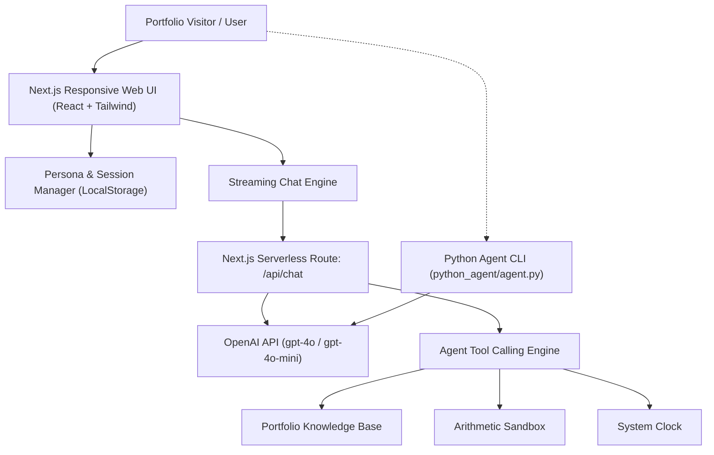

# ⚡ ZeeNexus OpenChat AI

[](https://nextjs.org/)
[](https://react.dev/)
[](https://www.typescriptlang.org/)
[](https://tailwindcss.com/)
[](https://openai.com/)
[](https://python.org/)
[](https://vercel.com/)

> **An autonomous, portfolio-integrated Agentic AI OpenChat platform built by [Rana Zeeshan](https://github.com) (`ZeeNexus`).**  
> Engineered with **Next.js (App Router)**, **React**, **TypeScript**, **Tailwind CSS**, and **OpenAI API**, alongside a dedicated **Autonomous Python Agent companion module**.

---

## 🌟 Highlights & Features

- 🧠 **Autonomous ReAct Framework**: Transparent chain-of-thought step decomposition (*Thought ➔ Action ➔ Observation ➔ Answer*) with collapsible reasoning cards in the UI.
- 🛠️ **Real-Time Tool & Function Calling**:
  - `search_portfolio`: Queries Rana Zeeshan's engineering skills, featured projects, and developer background.
  - `execute_code_sandbox`: Simulates and analyzes Python and TypeScript algorithms.
  - `get_system_time`: Synchronizes real-time timezones and system timestamps.
  - `calculate_expression`: Evaluates arithmetic and algorithmic expressions.
- 🎭 **Multi-Persona Agent Engine**: Seamlessly switch between:
  - **ZeeNexus Core**: General autonomous assistant with full tool privileges.
  - **Code Architect**: Senior Full-Stack systems engineer (Next.js, React, TypeScript, Python).
  - **Portfolio Ambassador**: Answers client and recruiter inquiries regarding Rana Zeeshan's experience.
  - **Agentic Researcher**: Deep analytical reasoning and step-by-step problem breakdown.
- ⚡ **Server-Sent Events (SSE) Streaming**: Low-latency token-by-token streaming response generation with live code block formatting and instant copy-to-clipboard.
- 🔐 **Dual API Key Strategy & Offline Simulation Mode**:
  - **Server-side**: Reads `OPENAI_API_KEY` from `.env.local` or Vercel Environment Variables.
  - **Bring Your Own Key (BYOK)**: Visitors can enter their own key in the UI (stored securely in browser `localStorage`).
  - **Interactive Simulation Mode**: Runs seamlessly out of the box with simulated ReAct execution if no key is provided, ensuring zero broken states for portfolio visitors!
- 🐍 **Autonomous Python Agent Module (`python_agent/`)**: Standalone CLI agent demonstrating core AI engineering, tool loops, and prompt pipelines in pure Python.

---

## 🏗️ Architecture



---

## 🚀 Quickstart (Local System)

### Prerequisites
- **Node.js**: `v18.18+` (Tested on `v22.17.0`)
- **npm**: `v9+`
- **Python**: `3.10+` (Optional for Python CLI companion)

### 1. Clone & Install
```bash
git clone https://github.com/your-username/ZeeNexus_openchat_ai.git
cd ZeeNexus_openchat_ai
npm install
```

### 2. Configure Environment Variables
Copy `.env.example` to `.env.local`:
```bash
cp .env.example .env.local
```
Add your OpenAI API key in `.env.local`:
```env
OPENAI_API_KEY=sk-your-openai-api-key-here
OPENAI_MODEL=gpt-4o-mini
```
*(Note: If you leave this blank, the app will run in Interactive Simulation Mode!)*

### 3. Run the Development Server
```bash
npm run dev
```
Open [http://localhost:3000](http://localhost:3000) in your browser.

---

## 🐍 Running the Autonomous Python Agent CLI

To run the standalone Python ReAct agent in terminal:

```bash
cd python_agent
pip install -r requirements.txt
python agent.py
```

To run the automated verification test:
```bash
python agent.py --test
```

---

## ☁️ Deploying to Vercel

1. Push your repository to **GitHub**:
   ```bash
   git init
   git add .
   git commit -m "Initial commit: ZeeNexus OpenChat AI"
   git branch -M main
   git remote add origin https://github.com/<your-username>/ZeeNexus_openchat_ai.git
   git push -u origin main
   ```

2. Go to [Vercel Dashboard](https://vercel.com/new) and import the repository.
3. In **Project Settings ➔ Environment Variables**, add:
   - `OPENAI_API_KEY`: Your OpenAI API Secret Key (`sk-...`)
   - `OPENAI_MODEL`: `gpt-4o-mini` (or `gpt-4o`)
4. Click **Deploy**. Vercel will automatically build and deploy both the Next.js frontend and serverless streaming backend!

---

## 📂 Project Structure

```text
ZeeNexus_openchat_ai/
├── src/
│   ├── app/
│   │   ├── api/chat/route.ts      # Streaming SSE OpenAI Route Handler & Tool Execution
│   │   ├── globals.css            # Dark glassmorphism & typography styles
│   │   ├── layout.tsx             # App shell with metadata & viewport
│   │   └── page.tsx               # Primary interactive chat page & state manager
│   ├── components/
│   │   ├── ApiKeyModal.tsx        # Client-side BYOK key management dialog
│   │   ├── ChatInput.tsx          # Auto-growing input, suggestions, model select
│   │   ├── ChatMessage.tsx        # Syntax-highlighted code & Markdown bubbles
│   │   ├── Header.tsx             # Brand header, persona switcher, status pulse
│   │   ├── ReasoningCard.tsx      # ReAct collapsible thinking & tool trace UI
│   │   └── Sidebar.tsx            # Session history & Rana Zeeshan portfolio card
│   └── lib/agent/
│       ├── portfolio-data.ts      # Structured developer bio, skills, and projects
│       ├── prompts.ts             # System prompts for all 4 agent personas
│       └── tools.ts               # Function definitions & execution handlers
├── python_agent/
│   ├── agent.py                   # Standalone Python ReAct agent CLI with tools
│   ├── README.md                  # Python agent documentation
│   └── requirements.txt           # Python dependencies
├── .env.example                   # Environment variable template
├── .gitignore                     # Git ignore rules (protects API keys & caches)
├── next.config.mjs                # Next.js configuration
├── package.json                   # Project manifest & scripts
├── tailwind.config.ts             # Cyber-executive dark color palette
├── tsconfig.json                  # TypeScript compiler settings
└── vercel.json                    # Vercel deployment configuration
```

---

## 👨‍💻 About the Developer

**Rana Zeeshan** (`ZeeNexus`)  
*Agentic AI & Full-Stack Engineer*  
- 💼 Specializing in autonomous multi-agent systems, LLM function calling, and scalable full-stack web platforms.
- 🌐 [Portfolio](https://zeenexus.dev) • 🐙 [GitHub](https://github.com) • 👔 [LinkedIn](https://linkedin.com)

---

## 📜 License
MIT License © 2026 Rana Zeeshan (ZeeNexus). Free for personal portfolio use and commercial customization.
